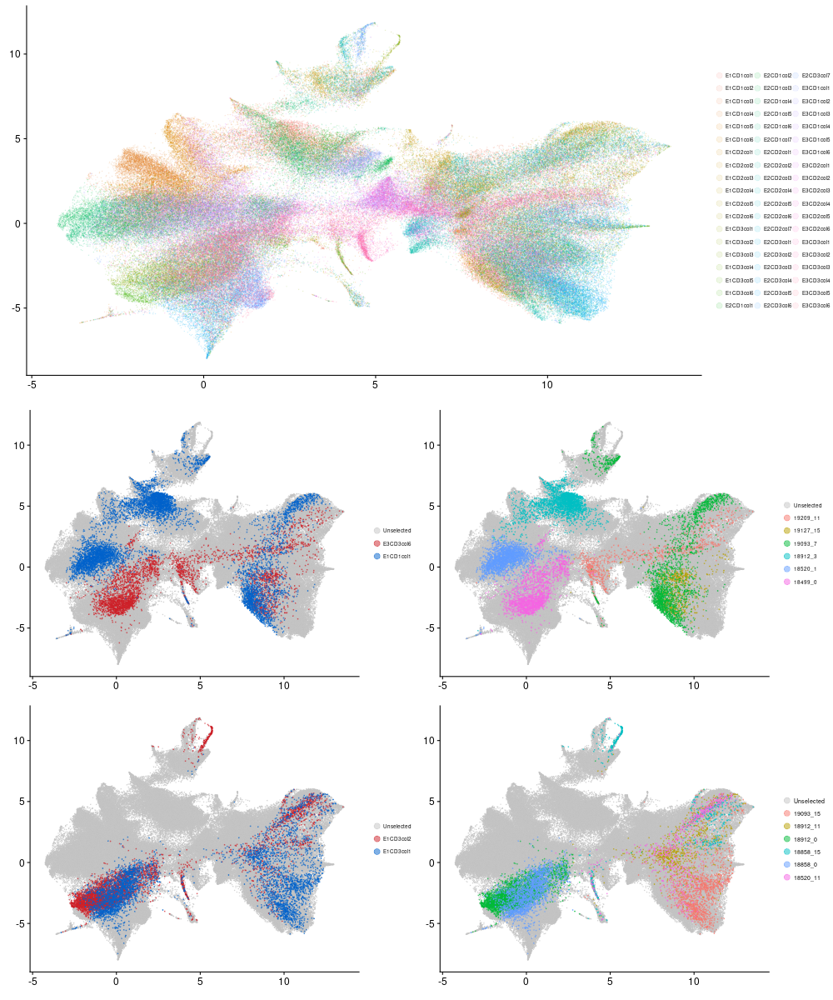

```{r libloader, warning=FALSE, echo=FALSE, message=FALSE}
library(Seurat)
library(Nebulosa)
library(tidyverse)
library(Matrix)
library(RColorBrewer) 
library(scales)
library(patchwork)
```

```{r file_load, echo=FALSE, warning=FALSE, message=FALSE}
sc <- readRDS("data/seurat.clustered.rds")
```
```{r color_scheme, echo=FALSE, warning=FALSE, message=FALSE}
# my_cols <- c(hue_pal()(7)[c(5,4,3,2,1,6)], "#949494")
# my_cols <- c("#0077BB", "#70d1d0", "#117733", "#E69F00", "#BF0202", "#663a82", "#949494")
my_cols <- c("#0077BB", "#70d1d0", "#117733", "#E69F00", "#BF0202", "#9640CE", "#949494")
my_cols_type <- c("#BF0202", "#E69F00", "#117733", "#70d1d0", "#0077BB", "#E08EF3", "#9640CE")
```

UMAP shows that cells from early differentiation days are most uniform, 

Louvain clustering (resolution 0.15) identifies subpopulations of cells present in the data
```{r include=FALSE}
fig1a <- DimPlot(sc, group.by="diffday", pt.size=0.75, cols=my_cols_type) *
  labs(color="Day") *
  theme(title=element_text(size=0), axis.title=element_text(size=20), 
        legend.text=element_text(size=15), legend.title=element_text(size=20))

fig1c <- DimPlot(sc, group.by="type", pt.size=0.75, cols=my_cols) *
  labs(color="Cell Type") *
  theme(title=element_text(size=0), axis.title=element_text(size=20), 
        legend.text=element_text(size=15), legend.title=element_text(size=20))
```

We can look at marker genes to map these clusters to the predominant cell types in this differentiation
*IPSC* - induced pluripotent stem cells (POU5F1)
*MES* - early mesoderm (MIXL1)
*CMES* - cardiac mesoderm (MESP1)
*PROG* - cardiac progenitor (ISL1)
*CM* - cardiomyocyte (TNNT2)
*CF* - cardiac fibroblast (COL3A1)
```{r marker_genes, warning=FALSE, message=FALSE, echo=FALSE}
fig1b1 <- plot_density(sc, "POU5F1")
fig1b2 <- plot_density(sc, "MIXL1")
fig1b3 <- plot_density(sc, "MESP1")
fig1b4 <- plot_density(sc, "GATA4")
fig1b5 <- plot_density(sc, "APOA1")
fig1b6 <- plot_density(sc, "COL3A1")
fig1b7 <- plot_density(sc, "VIM")
fig1b8 <- plot_density(sc, "TAGLN")
fig1b9 <- plot_density(sc, "TNNT2")
fig1b10 <- plot_density(sc, "MYL7")
fig1b <- ((fig1b1 | fig1b2) / (fig1b3 | fig1b4) / (fig1b5 |
  fig1b6) / (fig1b7 | fig1b8) / (fig1b9 | fig1b10)) & NoAxes() & NoLegend()
```

Early days are relatively uniform, consisting primarily of a single cell type, while more heterogeneity arises as cells progress through differentiation.
```{r}
daytype <- as_tibble(sc@meta.data[,c("diffday", "type")]) %>%
  mutate(n=1) %>%
  group_by(diffday) %>%
  mutate(day_tot=n()) %>%
  group_by(diffday, type, day_tot) %>%
  count %>%
  mutate(day_frac=n/day_tot)
test <- daytype %>%
  group_by(diffday) %>%
  mutate(x=n())
fig1d <- ggplot(daytype, aes(x=diffday, y=day_frac, fill=type)) +
  geom_bar(position="stack", stat="identity") +
  theme_classic(base_size=20) +
  theme(axis.text.x = element_text(angle=45, hjust=1)) +
  ylab("Fraction of Cells") + 
  xlab("Day") +
  labs(fill="Cell Type") +
  scale_fill_manual(values=my_cols)
```


Using a subset of these marker genes, we can examine how expression changes over time to see that cell lines proceed through differentiation at different rates, and seem to preferentially produce either cardiomyocytes (blue, marker gene TNNT2) or cardiac fibroblasts (purple, marker gene COL3A1).
```{r ct_prefs, warning=FALSE, message=FALSE, echo=FALSE}
meta <- as_tibble(sc@meta.data[,c("diffday", "individual")], rownames="cell")
rep.genes <- c("L1TD1", "TNNT2", "COL3A1")
rep.inds <- c("19209", "18489", "18505", "18912", "19127", "18508")
exp.marker <- as_tibble(t(sc[["SCT"]]@data[rep.genes,]), rownames="cell") %>% 
  inner_join(meta, by="cell") %>%
  gather(!c(cell, diffday, individual), key="gene", value="exp")
exp.sub <- exp.marker %>% 
  filter(individual %in% rep.inds) %>%
  mutate(gene=factor(gene, levels=rep.genes)) %>%
  mutate(individual=factor(individual, levels=rep.inds))
type.cols <- my_cols[c(1,5,6)]
fig1e <- ggplot(exp.sub, aes(x=diffday, y=exp, fill=gene)) +
  geom_violin(position=position_dodge(), trim=T, scale="width") +
  facet_grid(rows=vars(individual)) +
  theme_classic(base_size=20) +
  theme(axis.text.x = element_text(angle=45, hjust=1)) +
  scale_fill_manual(values=type.cols) +
  xlab("Day") +
  ylab("Expression") +
  labs(fill="Gene")
```

```{r}
fig1b <- fig1b + plot_layout(tag_level='new')
fig1de <- fig1d / fig1e
fig1bottom <- plot_grid(fig1b, fig1de, align="h", axis="b", rel_widths=c(1.5, 1))
fig1top <- plot_grid(fig1a, fig1c, align="h", axis="b", rel_widths=c(1, 1))
fig1 <- plot_grid(fig1top, fig1bottom, align="v", ncol=1, rel_heights = c(1, 4))

png('figs/fig1/fig1.png', width=1000, height=800)
plot(fig1)
dev.off()
```


Checking for batch effects - do cells appear to cluster by batch? (collection)?
```{r}
umap_batch <- DimPlot(sc, group.by="orig.ident") *
  labs(color="Batch") *
  theme(title=element_text(size=0), axis.title=element_text(size=20), 
        legend.text=element_text(size=15), legend.title=element_text(size=20))


sc.nounk <- readRDS("data/seurat.annotated.rds")
fa_batch <- DimPlot(sc.nounk, reduction="fa", group.by="orig.ident") *
  labs(color="Batch") *
  theme(title=element_text(size=0), axis.title=element_text(size=20), 
        legend.text=element_text(size=15), legend.title=element_text(size=20))

batch_fig <- umap_batch + fa_batch + plot_layout(nrow=2, guides="collect")

png('figs/supp/batch.png', width=1000, height=800)
plot(batch_fig)
dev.off()
```


Do cells from the same batch (collection) tend to come from the same cell type?
```{r}
celltypes <- as_tibble(sc@meta.data) %>%
  select(c(round, CD, col, individual_try2, diffday_try2, type)) %>%
  rename(ind=individual_try2, day=diffday_try2) 

cm_props <- celltypes %>%
  select(-day) %>%
  group_by(round, CD, col, type) %>%
  summarize(n=n()) %>%
  mutate(ctprop=n/sum(n)) %>%
  mutate(round=paste0("Round ", round)) %>%
  mutate(CD=paste0("CD", CD)) %>%
  filter(type %in% c("CM", "CF"))
ggplot(cm_props, aes(x=col, fill=type, y=ctprop)) +
  geom_bar(position="stack", stat="identity") +
  facet_grid(cols=vars(round), rows=vars(CD)) +
  theme_classic() +
  xlab("Collection") +
  ylab("Cell Type Proportion") +
  labs(fill="Cell Type")
```

How about when we separate by individual?
```{r}
cm_props_ind <- celltypes %>%
  select(-day) %>%
  filter(round==1) %>%
  select(-round) %>%
  group_by(CD, col, ind, type) %>%
  summarize(n=n()) %>%
  mutate(ctprop=n/sum(n)) %>%
  mutate(CD=paste0("CD", CD)) %>%
  filter(type %in% c("CM", "CF"))
ggplot(cm_props_ind, aes(x=col, fill=type, y=ctprop)) +
  geom_bar(position="stack", stat="identity") +
  facet_grid(cols=vars(ind), rows=vars(CD)) +
  xlab("Collection") +
  ylab("Cell Type Proportion") +
  labs(fill="Cell Type")
```

Quantitatively, we see that
```{r}
terminal_cts <- celltypes %>%
  filter(type %in% c("CM", "CF")) %>%
  mutate(batch=paste0("E", round, "CD", CD, "col", col)) %>%
  mutate(type=as.character(type))
m <- lm("type ~ batch", terminal_cts)
```
