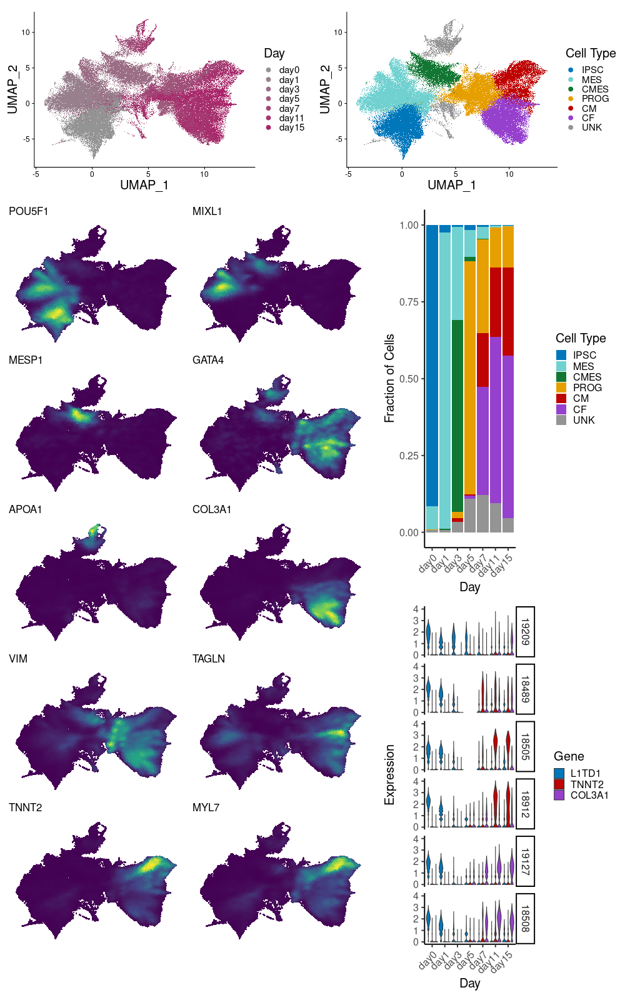

```{r libloader, warning=FALSE, echo=FALSE, message=FALSE}
library(Seurat)
library(Nebulosa)
library(tidyverse)
library(Matrix)
library(RColorBrewer) 
library(scales)
library(patchwork)
library(cowplot)
```

```{r file_load, echo=FALSE, warning=FALSE, message=FALSE}
sc <- readRDS("data/seurat.clustered.rds")
```

```{r color_scheme, echo=FALSE, warning=FALSE, message=FALSE}
# my_cols <- c(hue_pal()(7)[c(5,4,3,2,1,6)], "#949494")
my_cols_day <- c("#949494", "#98818D", "#9B6E85", "#9F5B7E", "#A34777",
                 "#A6346F", "#AA2168")
my_cols <- c("#0077BB", "#70d1d0", "#117733", "#E69F00", "#BF0202", "#9640CE")
my_cols_type <- c("#0077BB", "#70d1d0", "#117733", "#E69F00", "#BF0202", "#9640CE", "#949494")
```

UMAP shows that cells from early differentiation days are most uniform, 

Louvain clustering (resolution 0.15) identifies subpopulations of cells present in the data
```{r include=FALSE}
fig1a <- DimPlot(sc, group.by="diffday", pt.size=0.01, cols=my_cols_day) *
  labs(color="Day") *
  theme(title=element_text(size=0), axis.title=element_text(size=20), 
        legend.text=element_text(size=15), legend.title=element_text(size=20))

fig1c <- DimPlot(sc, group.by="type", pt.size=0.01, cols=my_cols_type) *
  labs(color="Cell Type") *
  theme(title=element_text(size=0), axis.title=element_text(size=20), 
        legend.text=element_text(size=15), legend.title=element_text(size=20))
```

We can look at marker genes to map these clusters to the predominant cell types in this differentiation
*IPSC* - induced pluripotent stem cells (POU5F1)
*MES* - early mesoderm (MIXL1)
*CMES* - cardiac mesoderm (MESP1)
*PROG* - cardiac progenitor (ISL1)
*CM* - cardiomyocyte (TNNT2)
*CF* - cardiac fibroblast (COL3A1)
```{r marker_genes, warning=FALSE, message=FALSE, echo=FALSE}
fig1b1 <- plot_density(sc, "POU5F1")
fig1b2 <- plot_density(sc, "MIXL1")
fig1b3 <- plot_density(sc, "MESP1")
fig1b4 <- plot_density(sc, "GATA4")
fig1b5 <- plot_density(sc, "APOA1")
fig1b6 <- plot_density(sc, "COL3A1")
fig1b7 <- plot_density(sc, "VIM")
fig1b8 <- plot_density(sc, "TAGLN")
fig1b9 <- plot_density(sc, "TNNT2")
fig1b10 <- plot_density(sc, "MYL7")
fig1b <- ((fig1b1 | fig1b2) / (fig1b3 | fig1b4) / (fig1b5 |
  fig1b6) / (fig1b7 | fig1b8) / (fig1b9 | fig1b10)) & NoAxes() & NoLegend()
```

Early days are relatively uniform, consisting primarily of a single cell type, while more heterogeneity arises as cells progress through differentiation.
```{r}
daytype <- as_tibble(sc@meta.data[,c("diffday", "type")]) %>%
  mutate(n=1) %>%
  group_by(diffday) %>%
  mutate(day_tot=n()) %>%
  group_by(diffday, type, day_tot) %>%
  count %>%
  mutate(day_frac=n/day_tot)
test <- daytype %>%
  group_by(diffday) %>%
  mutate(x=n())
fig1d <- ggplot(daytype, aes(x=diffday, y=day_frac, fill=type)) +
  geom_bar(position="stack", stat="identity") +
  theme_classic(base_size=20) +
  theme(axis.text.x = element_text(angle=45, hjust=1)) +
  ylab("Fraction of Cells") + 
  xlab("Day") +
  labs(fill="Cell Type") +
  scale_fill_manual(values=my_cols_type)
```


Using a subset of these marker genes, we can examine how expression changes over time to see that cell lines proceed through differentiation at different rates, and seem to preferentially produce either cardiomyocytes (blue, marker gene TNNT2) or cardiac fibroblasts (purple, marker gene COL3A1).
```{r ct_prefs, warning=FALSE, message=FALSE, echo=FALSE}
meta <- as_tibble(sc@meta.data[,c("diffday", "individual")], rownames="cell")
rep.genes <- c("L1TD1", "TNNT2", "COL3A1")
rep.inds <- c("19209", "18489", "18505", "18912", "19127", "18508")
exp.marker <- as_tibble(t(sc[["SCT"]]@data[rep.genes,]), rownames="cell") %>% 
  inner_join(meta, by="cell") %>%
  gather(!c(cell, diffday, individual), key="gene", value="exp")
exp.sub <- exp.marker %>% 
  filter(individual %in% rep.inds) %>%
  mutate(gene=factor(gene, levels=rep.genes)) %>%
  mutate(individual=factor(individual, levels=rep.inds))
type.cols <- my_cols[c(1,5,6)]
fig1e <- ggplot(exp.sub, aes(x=diffday, y=exp, fill=gene)) +
  geom_violin(position=position_dodge(), trim=T, scale="width") +
  facet_grid(rows=vars(individual)) +
  theme_classic(base_size=20) +
  theme(axis.text.x = element_text(angle=45, hjust=1)) +
  scale_fill_manual(values=type.cols) +
  xlab("Day") +
  ylab("Expression") +
  labs(fill="Gene")
```

```{r}
fig1b <- fig1b + plot_layout(tag_level='new')
fig1de <- fig1d / fig1e
fig1bottom <- plot_grid(fig1b, fig1de, align="h", axis="b", rel_widths=c(1.5, 1))
fig1top <- plot_grid(fig1a, fig1c, align="h", axis="b", rel_widths=c(1, 1))
fig1 <- plot_grid(fig1top, fig1bottom, align="v", ncol=1, rel_heights = c(1, 4))

png('figs/fig1/fig1.png', width=1000, height=1600)
plot(fig1)
dev.off()
```



Checking for batch effects - do cells appear to cluster by batch? (collection)?
```{r}
title.text.size = 8
legend.text.size = 6
large.plot.pt.size = 0.0001
small.plot.pt.size = 0.005
legend.pt.size = 0.5

umap_batch <- DimPlot(sc, group.by="orig.ident", pt.size=large.plot.pt.size, combine=F)[[1]] *
  labs(color="Batch") *
  theme(title=element_text(size=0), axis.title=element_text(size=title.text.size),
        legend.text=element_text(size=legend.text.size), 
        legend.title=element_text(size=title.text.size)) *
  guides(color=guide_legend(override.aes=list(size=legend.pt.size)))
umap_batch$layers[[1]]$aes_params$alpha = .1

# sc.nounk <- readRDS("data/seurat.annotated.rds")
# fa_batch <- DimPlot(sc.nounk, reduction="fa", group.by="orig.ident", pt.size=0.01, combine=F)[[1]] *
#   labs(color="Batch") *
#   theme(title=element_text(size=0), axis.title=element_text(size=20),
#         legend.text=element_text(size=15), legend.title=element_text(size=20))
# fa_batch$layers[[1]]$aes_params$alpha = .1
# 
# batch_fig <- umap_batch + fa_batch + plot_layout(nrow=2, guides="collect")
# 
# png('figs/supp/batch.png', width=1000, height=800)
# plot(batch_fig)
# dev.off()
```


How much of this clustering is due to sample and how much is due to batch?
```{r}
batch1.cells = colnames(sc)[sc$orig.ident=="E1CD1col1"]
batch2.cells = colnames(sc)[sc$orig.ident=="E3CD3col6"]
fig_batch1 <- DimPlot(sc, cells.highlight=list("E1CD1col1"=batch1.cells, 
                                               "E3CD3col6"=batch2.cells),
                         cols.highlight=c("#CE2029", "#0062CC"), sizes.highlight=c(small.plot.pt.size), combine=F)[[1]] *
  labs(color="Batch") *
  theme(title=element_text(size=0), axis.title=element_text(size=title.text.size), 
        legend.text=element_text(size=legend.text.size), 
        legend.title=element_text(size=title.text.size))  *
  guides(color=guide_legend(override.aes=list(size=legend.pt.size)))
fig_batch1$layers[[1]]$aes_params$alpha = .5

sample1.cells = colnames(sc)[sc$orig.ident=="E1CD1col1" & sc$individual=="18520" & sc$diffday=="day1"]
sample2.cells = colnames(sc)[sc$orig.ident=="E1CD1col1" & sc$individual=="18912" & sc$diffday=="day3"]
sample3.cells = colnames(sc)[sc$orig.ident=="E1CD1col1" & sc$individual=="19093" & sc$diffday=="day7"]
sample4.cells = colnames(sc)[sc$orig.ident=="E3CD3col6" & sc$individual=="18499" & sc$diffday=="day0"]
sample5.cells = colnames(sc)[sc$orig.ident=="E3CD3col6" & sc$individual=="19209" & sc$diffday=="day11"]
sample6.cells = colnames(sc)[sc$orig.ident=="E3CD3col6" & sc$individual=="19127" & sc$diffday=="day15"]

fig_sample1 <- DimPlot(sc, 
                       cells.highlight=list("18520_1"=sample1.cells, 
                                            "18912_3"=sample2.cells, 
                                            "19093_7"=sample3.cells, 
                                            "18499_0"=sample4.cells, 
                                            "19209_11"=sample5.cells, 
                                            "19127_15"=sample6.cells), 
                       cols.highlight = hue_pal()(6), sizes.highlight=c(small.plot.pt.size), combine=F)[[1]] *
  labs(color="Sample") *
  theme(title=element_text(size=0), axis.title=element_text(size=title.text.size), 
        legend.text=element_text(size=legend.text.size), 
        legend.title=element_text(size=title.text.size))  *
  guides(color=guide_legend(override.aes=list(size=legend.pt.size)))
fig_sample1$layers[[1]]$aes_params$alpha = .5
```


```{r}
batch3.cells = colnames(sc)[sc$orig.ident=="E1CD3col1"]
batch4.cells = colnames(sc)[sc$orig.ident=="E1CD3col2"]
fig_batch2 <- DimPlot(sc, cells.highlight=list("E1CD3col1"=batch3.cells, 
                                               "E1CD3col2"=batch4.cells),
                         cols.highlight=c("#CE2029", "#0062CC"), sizes.highlight=c(small.plot.pt.size), combine=F)[[1]] *
  labs(color="Batch") *
  theme(title=element_text(size=0), axis.title=element_text(size=title.text.size), 
        legend.text=element_text(size=legend.text.size), 
        legend.title=element_text(size=title.text.size))  *
  guides(color=guide_legend(override.aes=list(size=legend.pt.size)))
fig_batch2$layers[[1]]$aes_params$alpha = .5

sample1.cells = colnames(sc)[sc$orig.ident=="E1CD3col1" & sc$individual=="18858" & sc$diffday=="day0"]
sample2.cells = colnames(sc)[sc$orig.ident=="E1CD3col1" & sc$individual=="18912" & sc$diffday=="day11"]
sample3.cells = colnames(sc)[sc$orig.ident=="E1CD3col1" & sc$individual=="19093" & sc$diffday=="day15"]
sample4.cells = colnames(sc)[sc$orig.ident=="E1CD3col2" & sc$individual=="18912" & sc$diffday=="day0"]
sample5.cells = colnames(sc)[sc$orig.ident=="E1CD3col2" & sc$individual=="18520" & sc$diffday=="day11"]
sample6.cells = colnames(sc)[sc$orig.ident=="E1CD3col2" & sc$individual=="18858" & sc$diffday=="day15"]

fig_sample2 <- DimPlot(sc, 
                       cells.highlight=list("18858_0"=sample1.cells, 
                                            "18912_11"=sample2.cells, 
                                            "19093_15"=sample3.cells, 
                                            "18912_0"=sample4.cells, 
                                            "18520_11"=sample5.cells, 
                                            "18858_15"=sample6.cells), 
                       cols.highlight = hue_pal()(6), sizes.highlight=c(small.plot.pt.size), combine=F)[[1]] *
  labs(color="Sample") *
  theme(title=element_text(size=0), axis.title=element_text(size=title.text.size), 
        legend.text=element_text(size=legend.text.size), 
        legend.title=element_text(size=title.text.size))  *
  guides(color=guide_legend(override.aes=list(size=legend.pt.size)))
fig_sample2$layers[[1]]$aes_params$alpha = .5
```

```{r}
layout <- "
AABB
CCDD
" 
batch_bottom <- fig_batch1 + fig_sample1 + fig_batch2 + fig_sample2 + plot_layout(design=layout)
batch_full <- plot_grid(umap_batch, batch_bottom, align="v", ncol=1, rel_heights=c(1, 1.5))

# png('figs/supp/batch.png', width=1000, height=1200)
# plot(batch_full)
# dev.off()

ggsave("figs/supp/batch.eps", width=5.2, height=6.24, units="in", device=cairo_ps, 
       fallback_resolution=300)
# setEPS()
# postscript("figs/supp/batch.eps", width=5.2, height=6.24, paper="special")
# plot(batch_full)
# dev.off()
```


We also can visualize the umap from the subset data
```{r}
sc.nounk <- readRDS("data/seurat.processed_nounk.rds")
fig_umap2 <- DimPlot(sc.nounk, group.by="type", cols=my_cols) +
  ggtitle("")
  
png('figs/supp/umap2.png', width=1000, height=800)
plot(fig_umap2)
dev.off()
```

Finally, we can compare replicates from distinct batches
```{r}
sample1.cells = colnames(sc)[sc$orig.ident=="E1CD1col1" & sc$individual=="19093" & sc$diffday=="day7"]
sample2.cells = colnames(sc)[sc$orig.ident=="E1CD2col5" & sc$individual=="19093" & sc$diffday=="day7"]
fig_rep1 <- DimPlot(sc, cells.highlight=list("19093_7 rep1"=sample1.cells, "19093_7 rep2"=sample2.cells), 
                       cols.highlight = hue_pal()(6)[4:5], sizes.highlight=c(0.25), combine=F)[[1]]
fig_rep1$layers[[1]]$aes_params$alpha = .5

sample3.cells = colnames(sc)[sc$orig.ident=="E1CD2col3" & sc$individual=="18912" & sc$diffday=="day11"]
sample4.cells = colnames(sc)[sc$orig.ident=="E1CD3col1" & sc$individual=="18912" & sc$diffday=="day11"]
fig_rep2 <- DimPlot(sc, cells.highlight=list("18912_11 rep1"=sample3.cells, "18912_11 rep2"=sample4.cells), 
                       cols.highlight = hue_pal()(6)[c(1,6)], sizes.highlight=c(0.25), combine=F)[[1]]
fig_rep2$layers[[1]]$aes_params$alpha = .5
```

Do cells from the same batch (collection) tend to come from the same cell type?
```{r}
celltypes <- as_tibble(sc@meta.data) %>%
  select(c(round, CD, col, individual_try2, diffday_try2, type)) %>%
  rename(ind=individual_try2, day=diffday_try2) %>%
  unite(batch, c(round, CD, col), sep="_", remove=F) %>%
  unite(ind_day, c(ind, day), sep="_", remove=F)

cm_props <- celltypes %>%
  select(-day) %>%
  group_by(round, CD, col, type) %>%
  summarize(n=n()) %>%
  mutate(ctprop=n/sum(n)) %>%
  mutate(round=paste0("Round ", round)) %>%
  mutate(CD=paste0("CD", CD)) %>%
  filter(type %in% c("CM", "CF"))
ggplot(cm_props, aes(x=col, fill=type, y=ctprop)) +
  geom_bar(position="stack", stat="identity") +
  facet_grid(cols=vars(round), rows=vars(CD)) +
  theme_classic() +
  xlab("Collection") +
  ylab("Cell Type Proportion") +
  labs(fill="Cell Type")
```

How about when we separate by individual?
```{r}
cm_props_ind <- celltypes %>%
  select(-day) %>%
  filter(round==1) %>%
  select(-round) %>%
  group_by(CD, col, ind, type) %>%
  summarize(n=n()) %>%
  mutate(ctprop=n/sum(n)) %>%
  mutate(CD=paste0("CD", CD)) %>%
  filter(type %in% c("CM", "CF"))
ggplot(cm_props_ind, aes(x=col, fill=type, y=ctprop)) +
  geom_bar(position="stack", stat="identity") +
  facet_grid(cols=vars(ind), rows=vars(CD)) +
  xlab("Collection") +
  ylab("Cell Type Proportion") +
  labs(fill="Cell Type")
```

Quantitatively, if we subset to samples from collection day 3 that have been differentiating for 11-15 days, we have 38 samples with varying proportions of cardiomyocytes and cardiac fibroblasts. Each batch contains two of these samples. We compare the variance in cell type proportion that can be explained by batch assignments to the variance explained by random assignments of samples to a pair. 
```{r}
d11_15 <- celltypes %>%
  filter((day %in% c("Day 11", "Day 15")) & (CD == 3)) %>%
  group_by(batch, ind_day, type) %>%
  summarize(n=n()) %>%
  mutate(frac=n/sum(n)) %>%
  filter(type %in% c("CM", "CF"))

pseudobatches <- as.character(rep.int(seq(1, length(unique(d11_15$batch))), times=2))

d11_15_cm <- filter(d11_15, type=="CM")
ve_batch_cm <- summary(lm(frac ~ batch, d11_15_cm))$r.squared
ve_pseudobatch_cm <- c()
for (i in seq(1, 100)) {
  d11_15_cm$pseudobatch <- sample(pseudobatches, length(pseudobatches))
  ve_pseudobatch_cm <- c(ve_pseudobatch_cm, summary(lm(frac ~ pseudobatch, d11_15_cm))$r.squared)
}
```

```{r}
d11_15_cm <- filter(d11_15, type=="CM")
cmprops <- d11_15_cm$frac
names(cmprops) <- d11_15_cm$ind_day

d11_15_cf <- filter(d11_15, type=="CF")
cfprops <- d11_15_cf$frac
names(cfprops) <- d11_15_cf$ind_day

calc_ctproportion_diff <- function(sample1, sample2, props, ...) {
  abs(props[sample1] - props[sample2])
}

check_if_same_batch <- function(sample1, sample2, batch_assign, ...) {
  filter(batch_assign, ind_day==sample1)$batch == filter(batch_assign, ind_day==sample2)$batch
}

sample_pairs <- as_tibble(t(combn(d11_15_cm$ind_day, 2))) %>%
  rename(sample1=V1) %>% rename(sample2=V2) %>%
  filter(str_extract(sample1, "[^_]+$") != str_extract(sample2, "[^_]+$")) %>% 
  filter(str_extract(sample1, "[^_]+") != str_extract(sample2, "[^_]+")) %>%
  mutate(cm_prop_diff=pmap_dbl(., calc_ctproportion_diff, props=cmprops)) %>%
  mutate(cf_prop_diff=pmap_dbl(., calc_ctproportion_diff, props=cfprops)) %>%
  mutate(same_batch=pmap_lgl(., check_if_same_batch, batch_assign=d11_15_cm))

cm.batch.p <- t.test(x=filter(sample_pairs, same_batch==T)$cm_prop_diff, 
                     y=filter(sample_pairs, same_batch==F)$cm_prop_diff)$p.value
cf.batch.p <- t.test(x=filter(sample_pairs, same_batch==T)$cf_prop_diff, 
                     y=filter(sample_pairs, same_batch==F)$cf_prop_diff)$p.value
```

