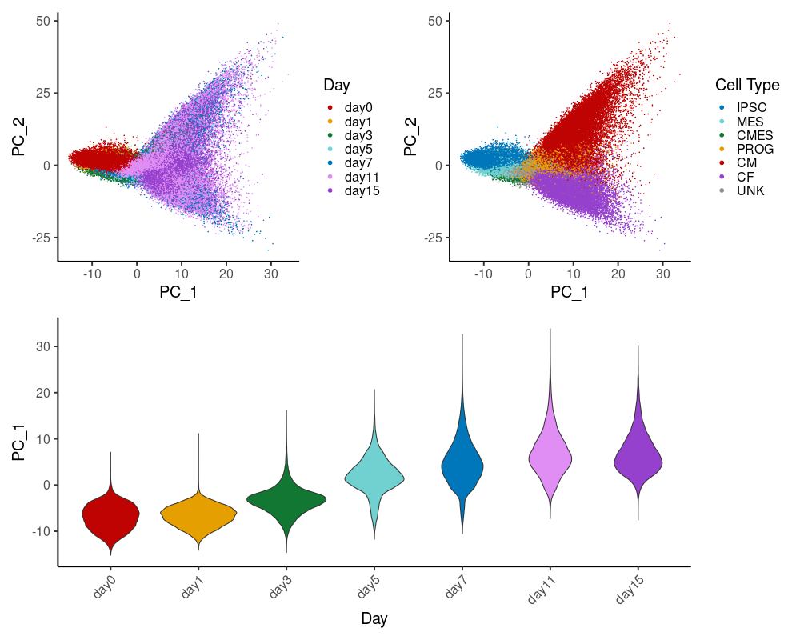

```{r libloader, warning=FALSE, message=FALSE, echo=FALSE}
library(tidyverse)
library(patchwork)
library(scales)
source("code/cell_line_pca.R")
library(rgl)
knitr::knit_hooks$set(webgl = hook_webgl)
library(RColorBrewer)
library(ggpubr)
library(vroom)
library(limma)
```

## Regular PCA
```{r fileload, warning=FALSE, message=FALSE, echo=FALSE}
bulk_pcs <- read_tsv("data/bulk/day/pcs.tsv") %>%
  mutate(ind=str_extract(sample, "[^_]+")) %>%
  mutate(day=as.numeric(str_extract(sample, "[^_]+$")))
pseudobulk_pcs <- read_tsv( "data/pseudobulk/day/pcs.tsv") %>%
  mutate(ind=str_extract(sample, "[^_]+")) %>%
  mutate(day=as.numeric(str_extract(sample, "[^_]+$")))
pseudobulk_cm_pcs <- read_tsv( "data/pseudobulk-cm/bin16/pcs.tsv") %>%
  mutate(ind=str_extract(sample, "[^_]+")) %>%
  mutate(bin=as.numeric(str_extract(sample, "[^_]+$")))
pseudobulk_cf_pcs <- read_tsv( "data/pseudobulk-cf/bin16/pcs.tsv") %>%
  mutate(ind=str_extract(sample, "[^_]+")) %>%
  mutate(bin=as.numeric(str_extract(sample, "[^_]+$")))
```

When we run PCA on both the bulk and pseudobulk data, we see that the primary source of variation between samples appears to be their progression through differentiation.
```{r regpca, warning=FALSE, echo=FALSE, message=FALSE}
ps1a <- ggplot(bulk_pcs, aes(x=PC1, y=PC2, color=day)) + 
  geom_point() + 
  theme_classic() +
  ggtitle("Bulk PCA") +
  scale_color_gradient(low = "gray", high = "#800000", na.value = NA) +
  theme(legend.position="none")

ps1b <- ggplot(bulk_pcs, aes(x=PC1, y=PC2, color=ind)) + 
  geom_point() + 
  theme_classic() +
  ggtitle("Bulk PCA") +
  theme(legend.position="none")

ps1c <- ggplot(pseudobulk_pcs, aes(x=PC1, y=PC2, color=day)) + 
  geom_point() + 
  theme_classic() +
  ggtitle("Pseudobulk PCA") +
  scale_color_gradient(low = "gray", high = "#800000", na.value = NA) +
  labs(color="Collection Day")

ps1d <- ggplot(pseudobulk_pcs, aes(x=PC1, y=PC2, color=ind)) + 
  geom_point() + 
  theme_classic() +
  ggtitle("Pseudobulk PCA") +
  labs(color="Individual")

ps1e <- ggplot(pseudobulk_cm_pcs, aes(x=PC1, y=PC2, color=bin)) + 
  geom_point() + 
  theme_classic() +
  ggtitle("CM Pseudobulk PCs") +
  scale_color_gradient(low = "gray", high = "#800000", na.value = NA) +
  theme(legend.position="none")

ps1f <- ggplot(pseudobulk_cm_pcs, aes(x=PC1, y=PC2, color=ind)) + 
  geom_point() + 
  theme_classic() +
  ggtitle("CM Pseudobulk PCs") +
  theme(legend.position="none")

ps1g <- ggplot(pseudobulk_cf_pcs, aes(x=PC1, y=PC2, color=bin)) + 
  geom_point() + 
  theme_classic() +
  ggtitle("CF Pseudobulk PCs") +
  scale_color_gradient(low = "gray", high = "#800000", na.value = NA) +
  theme(legend.position="none")

ps1h <- ggplot(pseudobulk_cf_pcs, aes(x=PC1, y=PC2, color=ind)) + 
  geom_point() + 
  theme_classic() +
  ggtitle("CF Pseudobulk PCs") +
  theme(legend.position="none")
```

```{r}
s1 <- ps1a + ps1b + ps1c + ps1d + ps1e + ps1f + ps1g + ps1h + plot_layout(ncol=2)
png('figs/supp1/supp1.png', width=600, height=900)
plot(s1)
dev.off()
```

What happens if we do not remove the low-depth samples?

How much of the variance captured by the first two principal components can be explained by pseudotime vs library size?
```{r}
cf_svals_before <- read_tsv("data/pseudobulk-cf-nodrop/bin16/logcpm.tsv") %>%
  column_to_rownames("gene") %>%
  apply(1, center.scale) %>%
  svd %>%
  .$d
pve_pcs_before <- (cf_svals_before^2) / sum(cf_svals_before^2)

cf_svals_after <- read_tsv("data/pseudobulk-cf/bin16/logcpm.tsv") %>%
  column_to_rownames("gene") %>%
  apply(1, center.scale) %>%
  svd %>%
  .$d
pve_pcs_after <- (cf_svals_after^2) / sum(cf_svals_after^2)

bulk_svals <- read_tsv("data/bulk/day/logtpm.tsv") %>%
  column_to_rownames("gene") %>%
  apply(1, center.scale) %>%
  svd %>%
  .$d
test <- (bulk_svals^2) / sum(bulk_svals^2)

before_removal <- read_tsv("results/eqtl_dynamic/linear_dQTL/pseudobulk-cf-nodrop/bin16/bin_medians.tsv") %>%
  rename(sample=binind) %>%
  inner_join(read_tsv("results/eqtl_dynamic/linear_dQTL/pseudobulk-cf-nodrop/bin16/bin_libsize.tsv"), by="sample") %>%
  inner_join(read_tsv("data/pseudobulk-cf-nodrop/bin16/pcs.tsv"), by="sample") %>%
  mutate(day=as.numeric(str_sub(sample, 7)), .after=1)

pve_pc1_before <- anova(lm(PC1~lib.size + t, before_removal))$`Sum Sq`
# sanity check, make sure order doesn't matter too much
pve_pc1_before_check <- anova(lm(PC1~t + lib.size, before_removal))$`Sum Sq`

pve_pc2_before <- anova(lm(PC2~lib.size + t, before_removal))$`Sum Sq`
# sanity check, make sure order doesn't matter too much
pve_pc2_before_check <- anova(lm(PC2~t + lib.size, before_removal))$`Sum Sq`

after_removal <- read_tsv("results/eqtl_dynamic/linear_dQTL/pseudobulk-cf/bin16/bin_medians.tsv") %>%
  rename(sample=binind) %>%
  inner_join(read_tsv("results/eqtl_dynamic/linear_dQTL/pseudobulk-cf/bin16/bin_libsize.tsv"), by="sample") %>%
  inner_join(read_tsv("data/pseudobulk-cf/bin16/pcs.tsv"), by="sample") %>%
  mutate(day=as.numeric(str_sub(sample, 7)), .after=1)

pve_pc1_after <- anova(lm(PC1~lib.size + t, after_removal))$`Sum Sq`
# sanity check, make sure order doesn't matter too much
pve_pc1_after_check <- anova(lm(PC1~t + lib.size, after_removal))$`Sum Sq`

pve_pc2_after <- anova(lm(PC2~lib.size + t, after_removal))$`Sum Sq`
# sanity check, make sure order doesn't matter too much
pve_pc2_after_check <- anova(lm(PC2~t + lib.size, after_removal))$`Sum Sq`

data_viz <- tibble(
  "PVE"=c(pve_pc1_before*pve_pcs_before[1], pve_pc1_after*pve_pcs_after[1], pve_pc2_before*pve_pcs_before[2], pve_pc2_after*pve_pcs_after[2]),
  "PC" = factor(rep(c(1, 2), each=6), levels=c(1,2)),
  "Dropped Samples"=factor(rep(c(rep("Before Subsetting", 3), rep("After Subsetting", 3)), 2), levels=c("Before Subsetting", "After Subsetting")),
  "Feature"=factor(rep(c("library size", "pseudotime", "other"), 4), levels=c("other", "library size", "pseudotime"))
)

ggplot(data_viz, aes(x=PC, y=PVE, fill=Feature)) +
  geom_bar(position="stack", stat="identity") +
  facet_grid(cols=vars(`Dropped Samples`)) +
  ylab("Proportion of Variance Explained") +
  theme_classic()
```

Now lets visualize the change in PC space
```{r}
ggplot(before_removal, aes(x=PC1, y=PC2, color=day)) +
  geom_point() + theme_classic()
ggplot(before_removal, aes(x=PC1, y=PC2, color=lib.size)) +
  geom_point() + theme_classic()

ggplot(after_removal, aes(x=PC1, y=PC2, color=day)) +
  geom_point() + theme_classic()
ggplot(after_removal, aes(x=PC1, y=PC2, color=lib.size)) +
  geom_point() + theme_classic()
```


```{r}
pve <- pb.pca$d^2/sum(pb.pca$d^2)
p2 <- tibble("PVE"=pve[1:100]) %>%
  rowid_to_column("PC") %>%
  ggplot(aes(x=PC,y=PVE)) + 
    geom_point() + 
    theme_classic() +
    ggtitle("Pseudobulk Scree")

bulk.pca <- regular.pca(bulk)
bulk.loadings <- bulk.pca$u %>% mutate(day=as.numeric(str_extract(sample, "[^_]+$")))
p3 <- ggplot(bulk.loadings, aes(x=PC1, y=PC2, color=day)) + 
  geom_point() + 
  theme_classic() +
  ggtitle("Bulk PCA")
pve <- bulk.pca$d^2/sum(bulk.pca$d^2)
p4 <- tibble("PVE"=pve[1:100]) %>%
  rowid_to_column("PC") %>%
  ggplot(aes(x=PC,y=PVE)) + 
    geom_point() + 
    theme_classic() +
    ggtitle("Bulk Scree")

p1 + p2 + p3 + p4 + plot_layout(ncol=2, nrow=2)
```

When we incorporate subsequent principal components (specifically in bulk), we are able to distinguish between more than just early differentiation and late differentiation - PCs 2, 3, and 4 distinguish between EMT/CM/EPDC
```{r sample_pc_lineage_detector, warning=FALSE, message=FALSE, echo=FALSE}
fracs <- read_tsv("results/cibersort/bulk.inferred.tsv") %>%
  rename(sample=Mixture) %>%
  select(!c(`P-value`, Correlation, RMSE)) %>%
  gather(!sample, key="type", value="pct") %>%
  group_by(sample) %>%
  filter(pct==max(pct)) %>%
  select(!pct)
cell.types <- c("iPSC", "meso", "cardiomes", "prog", "EMT", "CM", "EPDC")
p <- inner_join(fracs, bulk.loadings, by="sample") %>%
  gather(!c(sample, type, day), key="covariate", value="value") %>%
  mutate(type=factor(type, levels=cell.types)) %>%
  filter(covariate %in% paste0("PC", seq(1,5))) %>%
  mutate(covariate=factor(covariate, levels=paste0("PC", seq(1,5)))) %>%
  ggplot(aes(x=covariate, y=value, fill=type)) +
  geom_boxplot() + theme_classic()
p
```

What does this mean? Even in the bulk data, it is possible to resolve the multiple cell types we're working with
```{r, 3dplot, webgl=TRUE}
type.res <- fracs %>%
  left_join(bulk.loadings, by="sample") %>%
  mutate(type=factor(type, levels=c("iPSC", "meso", "cardiomes", "EMT", "prog", "CM", "EPDC")))
getPalette = colorRampPalette(brewer.pal(7, "Spectral"))
open3d()
plot3d(type.res$PC1, type.res$PC3, type.res$PC4,
       col=getPalette(7)[type.res$type],
       alpha=.75,
       size=2,
       type='s',
       xlab="PC1", ylab="PC3", zlab="PC4")
legend3d("topright", legend = levels(type.res$type), pch = 16, col = brewer.pal(7, "Spectral"), cex=1, inset=c(0.01, 0.01))
ggplot(type.res, aes(x=PC3, y=PC4, color=type)) +
  geom_point()
  
```

## PCs and technical covariates
First, we look at sample PCs, taken for each cell line/collection, to see how much variance is explained by known technical covariates
```{r}
technical.covariates <- vroom("/project2/gilad/reem/singlecellCM/SingleCellCMMetadataAllRounds-LineInfo.txt") %>%
  mutate(orig.ident=paste0("E", `Experiment Batch`, "CD", CD, "col", col)) %>%
  mutate(sample=paste(str_replace(Line, "NA", ""), orig.ident, sep="_"))
  
recorded <- colnames(technical.covariates)
revised <- c("Cell Line_fct", "Differentiation Day", "Feeder Psg", "Feeder Free Psg",
             "Date_fct", "CD_fct", "Collection_fct", "orig.ident", 
             "Exp_fct", "Differentiation Start Batch_fct", "Wells Collected",
             "Confluence (at Collection)", "Confluence (Day 0)", 
             "Beating (at Collection)", "First Day of Beating (of Well)", 
             "Pct Beating (at Collection)", 
             "First Day of Beating (of cell line/ diffstart)", 
             "Avg Day of Beating (of cell line/ diffstart)",
             "Network Appearance_fct", "Freezing_fct", "Sheet Appearance_fct", 
             "Debris_fct", "Swirls_fct", "Comments", "sample")
colnames(technical.covariates) <- revised
technical.covariates <- technical.covariates %>%
  select(-Comments) %>%
  mutate(across(ends_with("_fct"), as_factor)) %>%
  rename_with(~str_replace(., "_fct", ""), ends_with("_fct"))

samp.pcs <- read_tsv("/project2/gilad/jpopp/sc-dynamic-eqtl/data/pseudobulk/col/pcs.tsv")
```


```{r}
pb_day <- technical.covariates %>%
  inner_join(samp.pcs, by="sample")
```

```{r}
pcs <- paste0("PC", seq(1, 10))
covs <- setdiff(colnames(technical.covariates), c("Comments", "sample", "orig.ident"))
pve <- tibble("pc"=c(), "covariate"=c(), "r2"=c())
for (pc in pcs) {
  for (cov in covs) {
    pve <- bind_rows(pve, tibble("pc"=pc, "covariate"=cov, "r2"=summary(lm(paste0(pc, "~`", cov, "`"), pb_day))$r.squared))
  }
}
pve$pc <- factor(pve$pc, levels=paste0("PC", seq(1, 10)))
# arrange covariates by pve pc1
cov.levels <- pve %>%
  filter(pc=="PC1") %>%
  arrange(r2) %>%
  .$covariate
pve$covariate <- factor(pve$covariate, levels=cov.levels)
p <- ggplot(pve, aes(x=pc, y=covariate, fill=r2)) +
  geom_tile() +
  xlab("Sample PC") +
  ylab("Technical Covariate") +
  labs(fill="R2") +
  theme_classic()
png('../figs/supp/pb_day_pc_covs.png', width=600, height=400)
plot(p)
dev.off()
```

Now we look at a few additional covariates from our pseudotime binning samples
```{r}
lineage <- "cm"
nb <- "16"

libsize <- read_tsv(paste0("../results/eqtl_dynamic/linear_dQTL/pseudobulk-", lineage, "/bin", nb, "/bin_libsize.tsv"))
ncells <- read_tsv(paste0("../results/eqtl_dynamic/linear_dQTL/pseudobulk-", lineage, "/bin", nb, "/bin_ncells.tsv")) %>%
  rename(sample=binind)
pseudotime <- read_tsv(paste0("../results/eqtl_dynamic/linear_dQTL/pseudobulk-", lineage, "/bin", nb, "/bin_medians.tsv")) %>%
  rename(sample=binind)

samp.pcs <- read_tsv(paste0("../data/pseudobulk-", lineage, "/bin", nb, "/pcs.tsv"))
covariates <- inner_join(libsize, ncells, by="sample") %>% 
  inner_join(pseudotime, by="sample") %>%
  mutate(ind=str_extract(sample, "[^_]+"))
colnames(covariates) <- c("sample", "Library Size", "TMM Norm Factor", "Num. Cells", "Median Pseudotime", "Cell Line")

cm_bin <- inner_join(covariates, samp.pcs, by="sample")
```

```{r}
pcs <- paste0("PC", seq(1, 10))
covs <- setdiff(colnames(covariates), "sample")
pve <- tibble("pc"=c(), "covariate"=c(), "r2"=c())
for (pc in pcs) {
  for (cov in covs) {
    pve <- bind_rows(pve, tibble("pc"=pc, "covariate"=cov, "r2"=summary(lm(paste0(pc, "~`", cov, "`"), cm_bin))$r.squared))
  }
}
pve$pc <- factor(pve$pc, levels=paste0("PC", seq(1, 10)))
cov.levels <- pve %>%
  filter(pc=="PC1") %>%
  arrange(r2) %>%
  .$covariate
pve$covariate <- factor(pve$covariate, levels=cov.levels)
pve$lineage <- "CM"
pve_combined <- pve
p <- ggplot(pve, aes(x=pc, y=covariate, fill=r2)) +
  geom_tile() +
  xlab("Sample PC") +
  ylab("Technical Covariate") +
  labs(fill="R2") + 
  theme_classic()
png('../figs/supp/pb_cm16_pc_covs.png', width=600, height=400)
plot(p)
dev.off()
```

Same for the cardiac fibroblast lineage
```{r}
lineage <- "cf"
nb <- "16"

libsize <- read_tsv(paste0("../results/eqtl_dynamic/linear_dQTL/pseudobulk-", lineage, "/bin", nb, "/bin_libsize.tsv"))
ncells <- read_tsv(paste0("../results/eqtl_dynamic/linear_dQTL/pseudobulk-", lineage, "/bin", nb, "/bin_ncells.tsv")) %>%
  rename(sample=binind)
pseudotime <- read_tsv(paste0("../results/eqtl_dynamic/linear_dQTL/pseudobulk-", lineage, "/bin", nb, "/bin_medians.tsv")) %>%
  rename(sample=binind)

samp.pcs <- read_tsv(paste0("../data/pseudobulk-", lineage, "/bin", nb, "/pcs.tsv"))
covariates <- inner_join(libsize, ncells, by="sample") %>% 
  inner_join(pseudotime, by="sample") %>%
  mutate(ind=str_extract(sample, "[^_]+"))
colnames(covariates) <- c("sample", "Library Size", "TMM Norm Factor", "Num. Cells", "Median Pseudotime", "Cell Line")

cf_bin <- inner_join(covariates, samp.pcs, by="sample")
```

```{r}
pcs <- paste0("PC", seq(1, 10))
covs <- setdiff(colnames(covariates), "sample")
pve <- tibble("pc"=c(), "covariate"=c(), "r2"=c())
for (pc in pcs) {
  for (cov in covs) {
    pve <- bind_rows(pve, tibble("pc"=pc, "covariate"=cov, "r2"=summary(lm(paste0(pc, "~`", cov, "`"), cf_bin))$r.squared))
  }
}
pve$pc <- factor(pve$pc, levels=paste0("PC", seq(1, 10)))
cov.levels <- pve %>%
  filter(pc=="PC1") %>%
  arrange(r2) %>%
  .$covariate
pve$covariate <- factor(pve$covariate, levels=cov.levels)
pve$lineage <- "CF"
pve_combined <- bind_rows(pve, pve_combined)
p <- ggplot(pve_combined, aes(x=pc, y=covariate, fill=r2)) +
  geom_tile() +
  xlab("Sample PC") +
  ylab("Technical Covariate") +
  labs(fill="R2") + 
  facet_grid(cols=vars(lineage)) +
  theme_classic()

png('../figs/supp/pb_combined_pc_covs.png', width=800, height=400)
plot(p)
dev.off()
```

## Cell Line PCA
```{r clpca, warning=FALSE, message=FALSE, echo=FALSE}
bulk.clpca <- cell.line.pca(bulk)
pseudobulk.clpca <- cell.line.pca(pseudobulk)
```

### Scree plots
```{r clscree, warning=FALSE, message=FALSE, echo=FALSE}
plot(bulk.clpca$pve, main="Bulk Cell Line PVE", ylab="PVE", xlab="Cell Line PC")
plot(pseudobulk.clpca$pve, main="Pseudobulk Cell Line PVE", ylab="PVE", xlab="Cell Line PC")
```

### Prediction of differentiation speed
We see that the first bulk cell line PC appears to sort cell lines by differentiation speed
```{r bulk_deconv_order, fig.width=15, fig.height=10, warning=FALSE, message=FALSE, echo=FALSE}
bulk.clpc1.order <- bulk.clpca$cell.line.pcs %>% select(c(ind, PC_1)) %>% arrange(PC_1) %>% .$ind
cell.types <- c("iPSC", "meso", "EMT", "cardiomes", "prog", "CM", "EPDC")
bulk.props <- read_tsv("results/cibersort/bulk.inferred.tsv") %>% 
  select(!c(`P-value`, Correlation, RMSE)) %>%
  rename(sample=Mixture) %>%
  gather(!sample, key="type", value="frac") %>% 
  mutate(day=str_extract(sample, "[^_]+$")) %>%
  mutate(ind=str_extract(sample, "[^_]+")) %>%
  mutate(type=factor(type, levels=cell.types)) %>%
  mutate(day=as.numeric(day)) %>%
  mutate(ind=factor(ind, levels=bulk.clpc1.order)) %>%
  mutate(exp="bulk")
ggplot(bulk.props, aes(x=day, y=frac, fill=type)) +
  geom_area(alpha=0.6 , size=1, colour="black") +
  facet_grid(rows=vars(ind)) +
  theme_classic() + theme(axis.ticks.y = element_blank(), axis.text.y=element_blank())
```

```{r bulk_diffspeed_cor, echo=FALSE, warning=FALSE, message=FALSE}
ct.proportions <- read_tsv("results/cibersort/bulk.inferred.tsv") %>%
  rename(sample=Mixture)

diff.speed <- ct.proportions %>% 
  mutate(early=iPSC+meso) %>%
  mutate(ind=substr(sample, 1, 5)) %>%
  group_by(ind) %>%
  summarize(delay=sum(early), epdc=sum(EPDC), cm=sum(CM), emt=sum(EMT)) %>%
  right_join(bulk.clpca$cell.line.pcs, by="ind")

ggplot(diff.speed, aes(x=PC_1, y=delay)) +
  geom_point() +
  theme_classic() +
  ylab("Differentiation Speed") +
  xlab("Cell Line PC1") +
  stat_cor(method = "pearson", cor.coef.name="rho", aes(label = ..r.label..))
```

This trend appears with pseudobulk as well
```{r, fig.width=15, fig.height=10, echo=FALSE, warning=FALSE, message=FALSE}
pseudobulk.clpc1.order <- pseudobulk.clpca$cell.line.pcs %>% select(c(ind, PC_1)) %>% arrange(PC_1) %>% .$ind
pseudobulk.props <- read_tsv("results/cibersort/pseudobulk_fracs.indday.full.true.tsv") %>% 
  gather(!sample, key="type", value="frac") %>% 
  mutate(day=str_extract(sample, "[^_]+$")) %>%
  mutate(ind=str_extract(sample, "[^_]+")) %>%
  mutate(type=factor(type, levels=cell.types)) %>%
  mutate(day=as.numeric(day)) %>%
  mutate(ind=factor(ind, levels=pseudobulk.clpc1.order)) %>%
  mutate(exp="bulk")
ggplot(pseudobulk.props, aes(x=day, y=frac, fill=type)) +
  geom_area(alpha=0.6 , size=1, colour="black") +
  facet_grid(rows=vars(ind)) +
  theme_classic() + theme(axis.ticks.y = element_blank(), axis.text.y=element_blank())
```

### Terminal cell type prediction
While the first cell line PC separates cell lines by differentiation speed, the second cell line PC differentiates between those cell lines that primarily produce cardiomyocytes and those that primarily produce epicardium-like cells
```{r ctpreds, echo=FALSE, message=FALSE, warning=FALSE}
terminal.cell.type <- ct.proportions %>%
  select(!c(`P-value`, Correlation, RMSE)) %>%
  mutate(ind=str_sub(sample, 1, 5)) %>%
  mutate(day=as.numeric(str_extract(sample, "[^_]+$"))) %>%
  gather(!c(sample, ind, day), key="type", value="frac") %>%
  filter(day %in% seq(10, 15)) %>%
  group_by(ind, type) %>%
  summarize(frac=sum(frac)) %>%
  group_by(ind) %>%
  slice(which.max(frac)) %>%
  select(!frac) %>%
  left_join(bulk.clpca$cell.line.pcs) %>%
  mutate(type=factor(type, levels=c("CM", "EPDC", "EMT"))) %>%
  gather(!c(ind, type), key="covariate", value="value") %>%
  mutate(covariate=factor(covariate, levels=paste0("PC_", seq(1, 5))))

ggplot(terminal.cell.type, aes(x=covariate, fill=type, y=value)) +
  geom_boxplot() + theme_classic() + xlab("Cell Line PC")
```

## Cell Line PCA of Pseudotime-Aggregated Pseudobulk Data
If cell line PCA is primarily picking up on differences in differentiation speed and trajectory preference between cell lines, it is not immediately apparent that it would be necessary to apply cell line PCA to some of our other models, like dynamic eQTL calling on pseudobulk data aggregated by cell type. 
```{r cmbin_clpca, echo=FALSE, warning=FALSE, message=FALSE}
pb.cmbin <- read_tsv( "data/pseudobulk_logcpm.cmbin.full.tsv") 
pseudobulk.clpca <- cell.line.pca(pb.cmbin)
plot(pseudobulk.clpca$pve, main="Pseudobulk Cell Line PVE", ylab="PVE", xlab="Cell Line PC")
```

However, if cell lines differentiate at different speeds, we will see broad differences in the distribution of cells across the pseudotime bins. This will impact TMM normalization, leading to differences between cell lines. 
```{r cmbin_diffspeed, echo=FALSE, warning=FALSE, message=FALSE}
ct.proportions <- read_tsv("results/cibersort/pseudobulk_fracs.indday.full.true.tsv")

diff.speed <- ct.proportions %>% 
  mutate(early=iPSC+meso) %>%
  mutate(ind=substr(sample, 1, 5)) %>%
  group_by(ind) %>%
  summarize(delay=sum(early)) %>%
  right_join(pseudobulk.clpca$cell.line.pcs, by="ind")

ggplot(diff.speed, aes(x=PC_1, y=delay)) +
  geom_point() +
  theme_classic() +
  ylab("Differentiation Speed") +
  xlab("Cell Line PC1") +
  stat_cor(method = "pearson", cor.coef.name="rho", aes(label = ..r.label..))
```

## Single Cell PCs
We got these PCs by scaling the SCTransform Pearson residuals
```{r}
pcs <- read_tsv("data/marcc_transfer3/pcs_fulldata.tsv")
sc.full <- readRDS("data/seurat.clustered.rds")
meta <- as_tibble(sc.full@meta.data, rownames="cell")
my_cols_type <- c("#0077BB", "#70d1d0", "#117733", "#E69F00", "#BF0202", "#9640CE", "#949494")
my_cols_day <- c("#BF0202", "#E69F00", "#117733", "#70d1d0", "#0077BB", "#E08EF3", "#9640CE")

embedding <- inner_join(select(pcs, c(cell, `PC_1`, `PC_2`, `PC_3`)), meta, by="cell")
p1 <- ggplot(embedding, aes(x=`PC_1`, y=`PC_2`, color=diffday)) +
  geom_point(size=0.01) +
  theme_classic(base_size=20) +
  labs(color="Day") +
  guides(color = guide_legend(override.aes = list(size=2))) +
  scale_color_manual(values=my_cols_day)
p2 <- ggplot(embedding, aes(x=diffday, y=`PC_1`, fill=diffday)) +
  geom_violin() +
  theme_classic(base_size=20) +
  theme(axis.text.x=element_text(angle=45, hjust=1), legend.position="none") +
  xlab("Day") +
  scale_fill_manual(values=my_cols_day)
p3 <- ggplot(embedding, aes(x=`PC_1`, y=`PC_2`, color=type)) +
  geom_point(size=0.01) +
  theme_classic(base_size=20) +
  labs(color="Cell Type") +
  guides(color = guide_legend(override.aes = list(size=2))) +
  scale_color_manual(values=my_cols_type)
p4 <- ggplot(embedding, aes(x=type, y=`PC_2`, fill=type)) +
  geom_violin() +
  theme_classic(base_size=20) +
  theme(axis.text.x=element_text(angle=45, hjust=1), legend.position="none") +
  xlab("Cell Type") +
  scale_fill_manual(values=my_cols_type)

figs1 <- (p1 + p3) / p2
png('figs/supp/sc_pcs.png', width=1000, height=800)
plot(figs1)
dev.off()
```


<!-- ## Correlation Analysis -->
<!-- Looking within each time point, do bulk samples from a specific cell line look more similar to pseudobulk samples from the same cell line than they do others? (Looking across all genes) -->
<!-- ```{r} -->
<!-- p <- read_tsv("results/eqtl_static/correlation.tsv") -->
<!-- p <- p %>% mutate(sim=if_else(cl1==cl2, "same", "diff")) -->
<!-- ggplot(p, aes(x=sim, y=rho, fill=sim)) + -->
<!--   geom_boxplot() + -->
<!--   facet_grid(rows=vars(day), cols=vars(npcs)) -->
<!-- ``` -->
<!-- Focus on one example and perform Wilcoxon's Rank Sum Test -->

<!-- ```{r, warning=FALSE, message=FALSE} -->
<!-- p1 <- p %>% filter((day=="day0") & (npcs==3)) -->
<!-- alt <- p1 %>% filter(sim=="same") %>% .$rho -->
<!-- null <- p1 %>% filter(sim=="diff") %>% .$rho -->
<!-- wilcox.test(alt, null, 'g') -->
<!-- ``` -->

<!-- Now look at a different metric, where each point corresponds to a single gene's correlation between  -->
<!-- ```{r} -->
<!-- p.gene <- read_tsv("results/eqtl_static/correlation2.tsv") -->
<!-- ggplot(p.gene, aes(x=permuted, y=rho, fill=permuted)) + -->
<!--   geom_boxplot() + -->
<!--   facet_grid(rows=vars(day), cols=vars(npcs)) -->
<!-- ``` -->

<!-- Focus on one example and perform Wilcoxon's Rank Sum Test -->
<!-- ```{r, warning=FALSE, message=FALSE} -->
<!-- p.gene1 <- p.gene %>% filter((day=="day0") & (npcs==0)) -->
<!-- alt <- p.gene1 %>% filter(permuted==FALSE) %>% .$rho -->
<!-- null <- p.gene1 %>% filter(permuted==TRUE) %>% .$rho -->
<!-- wilcox.test(alt, null, 'g') -->
<!-- ``` -->
