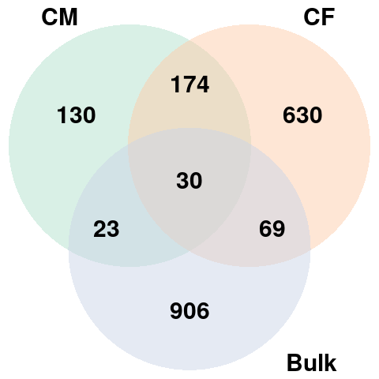

```{r libloader, include=FALSE}
library(tidyverse)
library(qvalue)
library(plotly)
library(patchwork)
library(ggpubr)
library(vroom)
library(scales)
library(Seurat)
library(VennDiagram)
library(RColorBrewer)
source("code/viz_helpers.R")
```

How many hits do we get from bulk vs pseudobulk linear dynamic eQTLs?

```{r}
count.hits.lfsr <- function(dataset, agg, ...) {
  nrow(filter(vroom(paste0("results/eqtl_dynamic/linear_dQTL/", dataset, "/", agg, "/50k-5clpcs-0pcs-notypes.tophits.tsv")), lfsr<=0.05))
}

count.hits.qval <- function(dataset, agg, ...) {
  nrow(filter(vroom(paste0("results/eqtl_dynamic/linear_dQTL/", dataset, "/", agg, "/50k-5clpcs-0pcs-notypes.tophits.tsv")), qval.unadj<=0.05))
}

hitcounts <- tibble("dataset"=c("bulk", "bulk7", "pseudobulk", rep(c("pseudobulk-cm", "pseudobulk-cf"),each=3)), "agg"=c(rep("day", 4), paste0("bin", c(7, 16)), "day", paste0("bin", c(7, 16))))
hitcounts$dataset <- factor(hitcounts$dataset, levels=c("bulk", "bulk7", "pseudobulk", "pseudobulk-cm", "pseudobulk-cf"))
hitcounts$agg <- factor(hitcounts$agg, levels=c("day", "bin7", "bin16"))
hitcounts$hits <- pmap_dbl(hitcounts, count.hits.qval)
ggplot(hitcounts, aes(x=agg, y=hits, fill=agg)) + 
  geom_bar(position="dodge", stat="identity") +
  facet_grid(cols=vars(dataset)) +
  theme(axis.text.x=element_text(angle=45, hjust=1)) +
  xlab("Aggregation Method") +
  ylab("Number of Bonferroni/ Q-Value Hits")
```

How many bins should we use for pseudotime?
```{r}
count.hits.lfsr <- function(dataset, agg, ...) {
  nrow(filter(vroom(paste0("results/eqtl_dynamic/linear_dQTL/", dataset, "/", agg, "/50k-5clpcs-0pcs-notypes.tophits.tsv")), lfsr<=0.05))
}

count.hits.qval <- function(dataset, agg, ...) {
  nrow(filter(vroom(paste0("results/eqtl_dynamic/linear_dQTL/", dataset, "/", agg, "/50k-5clpcs-0pcs-notypes.tophits.tsv")), qval.unadj<=0.05))
}

binnings = factor(paste0("bin", rep(c(5, 10, 15, 20, 25, 30), times=2)), levels = paste0("bin", c(5, 10, 15, 20, 25, 30)))
groups <- tibble("dataset"=rep(c("pseudobulk-cm", "pseudobulk-cf"), each=6), "agg"=binnings)

groups$hits <- pmap_dbl(groups, count.hits.qval)

groups <- mutate(groups, agg=as.numeric(str_replace(agg, "bin", "")))

ggplot(groups, aes(x=agg, y=hits, fill=agg)) + 
  geom_bar(position="dodge", stat="identity") +
  facet_grid(cols=vars(dataset)) +
  theme(axis.text.x=element_text(angle=45, hjust=1))  +
  theme_classic() +
  theme(legend.position="none") +
  xlab("Number of pseudotime bins") +
  ylab("Number of Linear Dynamic eGenes")
```

How many do we get after regressing out cell type proportion?
```{r}
count.hits.lfsr <- function(dataset, agg, ...) {
  nrow(filter(vroom(paste0("results/eqtl_dynamic/linear_dQTL/", dataset, "/", agg, "/50k-5clpcs-0pcs-regtypes.tophits.tsv")), lfsr<=0.05))
}

count.hits.qval <- function(dataset, agg, ...) {
  nrow(filter(vroom(paste0("results/eqtl_dynamic/linear_dQTL/", dataset, "/", agg, "/50k-5clpcs-0pcs-regtypes.tophits.tsv")), qval.unadj<=0.05))
}

groups <- tibble("dataset"=c("bulk", "pseudobulk"), "agg"=rep("day", 2))

groups$hits <- pmap_dbl(groups, count.hits.qval)

ggplot(groups, aes(x=agg, y=hits, fill=agg)) + 
  geom_bar(position="dodge", stat="identity") +
  facet_grid(cols=vars(dataset)) +
  theme(axis.text.x=element_text(angle=45, hjust=1))
```


## dynQTL Visualization 
```{r classify_fcn, echo=FALSE, warning=FALSE, message=FALSE}
classify.dynqtl <- function(beta.g, beta.gxt, beta.t, ..., t.low=0, t.high=15, thresh=1) {
  beta.vgt.early = (beta.t*t.low + beta.gxt*0*t.low + beta.g*0) - (beta.t*t.low + beta.gxt*2*t.low + beta.g*2)
  beta.vgt.late = (beta.t*t.high + beta.gxt*0*t.high + beta.g*0) - (beta.t*t.high + beta.gxt*2*t.high + beta.g*2)
  
  if (sign(beta.vgt.early)==sign(beta.vgt.late)) {
    qtl.type = if_else(abs(beta.vgt.early)>=abs(beta.vgt.late), "early", "late")
  } else {
    if ((abs(beta.vgt.early)>=abs(beta.vgt.late)) & (abs(beta.vgt.late)<thresh)) {
      qtl.type = "early"
    } else if ((abs(beta.vgt.early)<abs(beta.vgt.late)) & (abs(beta.vgt.early)<thresh)) {
      qtl.type = "late"
    } else if ((abs(beta.vgt.early)>=thresh) & (abs(beta.vgt.late)>=thresh)) {
      qtl.type = "switch"
    }
  }
}

nbin <- 16
cm.medians <- read_tsv(paste0("results/eqtl_dynamic/linear_dQTL/pseudobulk-cm/bin", nbin, "/bin_medians.tsv"))
t.low.cm <- cm.medians %>% 
  mutate(bin=str_extract(binind, "[^_]+$")) %>%
  filter(bin == 0) %>%
  .$t %>%
  median
t.high.cm <- cm.medians %>% 
  mutate(bin=str_extract(binind, "[^_]+$")) %>%
  filter(bin == nbin-1) %>%
  .$t %>%
  median

cf.medians <- read_tsv(paste0("results/eqtl_dynamic/linear_dQTL/pseudobulk-cf/bin", nbin, "/bin_medians.tsv"))
t.low.cf <- cf.medians %>% 
  mutate(bin=str_extract(binind, "[^_]+$")) %>%
  filter(bin == 0) %>%
  .$t %>%
  median
t.high.cf <- cf.medians %>% 
  mutate(bin=str_extract(binind, "[^_]+$")) %>%
  filter(bin == nbin-1) %>%
  .$t %>%
  median
```

```{r dynqtl_vis, warning=FALSE, message=FALSE, echo=FALSE}
dynqtl_cm <- read_tsv("results/eqtl_dynamic/linear_dQTL/pseudobulk-cm/bin16/50k-5clpcs-0pcs-notypes.tophits.tsv") %>%
  filter(qval.unadj<=0.05) %>% 
  arrange(p.unadj) %>%
  mutate(qtl.type=pmap_chr(., classify.dynqtl, t.low=t.low.cm, t.high=t.high.cm)) %>%
  group_by(qtl.type) %>%
  mutate(celltype="CM")
dynqtl_cf <- read_tsv("results/eqtl_dynamic/linear_dQTL/pseudobulk-cf/bin16/50k-5clpcs-0pcs-notypes.tophits.tsv") %>%
  filter(qval.unadj<=0.05) %>% 
  arrange(p.unadj) %>%
  mutate(qtl.type=pmap_chr(., classify.dynqtl, t.low=t.low.cf, t.high=t.high.cf)) %>%
  group_by(qtl.type) %>%
  mutate(celltype="CF")
dynqtl <- bind_rows(dynqtl_cm, dynqtl_cf) %>%
  select(gene, snp, bonf.p.unadj, qval.unadj, lfsr, qtl.type, celltype)

cm_expr_all <- read_tsv("data/pseudobulk-cm/bin16/logcpm.tsv")
cf_expr_all <- read_tsv("data/pseudobulk-cf/bin16/logcpm.tsv")
geno_all <- vroom("data/genotypes.tsv") %>%
  filter(snp %in% dynqtl$snp) %>%
  mutate(across(starts_with("1"), round))
genodict <- vroom("data/YRI.hg38.filtered.tsv", col_select=c("#CHROM", "POS", "REF", "ALT", "ID")) %>%
  mutate(snp=paste(`#CHROM`, POS, sep="_"), .keep="unused")

dosage2geno <- function(evariant, genotype, ..., genodict.snp) {
  ref <- genodict.snp$REF
  alt <- genodict.snp$ALT
  if (genotype == "0") {
    geno = paste0(ref, ref)
  } else if (genotype == "1") {
    geno = paste0(ref, alt)
  } else {
    geno = paste0(alt, alt)
  }
  geno
}
```

```{r}
cell.types <- c("IPSC", "MES", "CMES", "PROG", "CM", "CF", "UNK")
bulk <- read_tsv("results/cibersort/bulk.inferred.tsv") %>% 
  select(!c(`P-value`, Correlation, RMSE)) %>%
  rename(sample=Mixture) %>%
  gather(!sample, key="type", value="frac") %>% 
  mutate(day=str_extract(sample, "[^_]+$")) %>%
  mutate(ind=str_extract(sample, "[^_]+")) %>%
  mutate(type=factor(type, levels=cell.types)) %>%
  mutate(day=as.numeric(day)) %>%
  mutate(ind=factor(ind)) %>%
  mutate(exp="bulk")

pseudobulk <- read_tsv("results/cibersort/pseudobulk_indday.full.true.tsv") %>% 
  gather(!sample, key="type", value="frac") %>% 
  mutate(day=str_extract(sample, "[^_]+$")) %>%
  mutate(day=str_replace(day, "day", "")) %>%
  mutate(ind=str_extract(sample, "[^_]+")) %>%
  mutate(type=factor(type, levels=cell.types)) %>%
  mutate(day=as.numeric(day)) %>%
  mutate(ind=factor(ind)) %>%
  mutate(exp="pseudobulk")
props <- bind_rows(bulk, pseudobulk)
```

```{r}
early.dqtls <- filter(dynqtl, qtl.type=="early")
egene <- "UTF1"
cm_expr <- cm_expr_all %>% 
  filter(gene==!!egene) %>% 
  column_to_rownames("gene") %>% t %>% 
  as_tibble(rownames="ind") %>% 
  `colnames<-`(c("sample", "logcpm")) %>%
  mutate(day=str_extract(sample, "[^_]+$")) %>%
  mutate(ind=str_extract(sample, "[^_]+")) %>%
  mutate(exp="cm")
cf_expr <- cf_expr_all %>% filter(gene==!!egene) %>% 
  column_to_rownames("gene") %>% t %>% 
  as_tibble(rownames="ind") %>% 
  `colnames<-`(c("sample", "logcpm")) %>%
  mutate(day=str_extract(sample, "[^_]+$")) %>%
  mutate(ind=str_extract(sample, "[^_]+")) %>%
  mutate(exp="cf")
expr <- bind_rows(cm_expr, cf_expr)

dynqtl.i <- filter(dynqtl, gene == egene) %>% arrange(qval.unadj) %>% slice_head(n=1)
evar <- dynqtl.i$snp
geno <- geno_all %>% filter(snp==evar) %>%
  column_to_rownames("snp") %>% t %>% 
  as_tibble(rownames="ind") %>% 
  `colnames<-`(c("ind", "genotype")) %>%
  mutate(ind=str_replace(ind, "NA", ""))
dynvis <- left_join(expr, geno, by="ind") %>%
  mutate(logtpm=as.numeric(logcpm)) %>%
  mutate(genotype=factor(genotype, levels=c("0","1","2"))) %>%
  mutate(ind=factor(ind)) %>%
  mutate(day=factor(day, levels=seq(0, 15))) %>%
  mutate(celltype=if_else(exp=="cm", "Cardiomyocyte Lineage", "Cardiac Fibroblast Lineage")) %>%
  mutate(geno=pmap_chr(., .f=dosage2geno, genodict.snp=filter(genodict, snp==evar)))
ggplot(filter(dynvis, exp=="cm"), aes(x=day, y=logcpm, fill=geno)) + 
  geom_boxplot() +
  ylab(egene) +
  xlab("Pseudotime Bin") +
  labs(fill=filter(genodict, snp==evar)$ID) +
  theme_classic() 
```

Does this variant seem to sort by terminal cell type? No, but we wouldn't expect it to, anything that did should be removed when controlling for cell line PCs
```{r}
test <- props %>%
  left_join(geno, by="ind") %>%
  arrange(genotype) %>%
  mutate(ind=factor(ind, levels=unique(.$ind)))

ggplot(test, aes(x=day, y=frac, fill=type)) +
  geom_area(alpha=0.6 , size=0.5, colour="black") +
  facet_grid(rows=vars(ind), cols=vars(exp)) +
  theme_classic() + theme(axis.ticks.y = element_blank(), axis.text.y=element_blank()) +
  scale_fill_manual(values=my_cols)
```

## Dynamic eQTL Visualization
### Example dynamic eQTL (CM lineage)
```{r}
cm_nl_dqtl <- vroom("../results/eqtl_dynamic/nonlinear_dQTL/pseudobulk-cm/bin16/t_test/50k-5clpcs-0pcs-notypes.tophits.tsv") %>%
  filter(qval.unadj<0.05) %>%
  arrange(bonf.p.unadj)

vizhit <- cm_nl_dqtl[5,]
p <- viz_residuals_nonlinear(vizhit$gene, vizhit$snp, "pseudobulk-cm", "bin16")
```

### GWAS Overlap 
```{r}
hypertension <- "data/gwas/imputed_gwas_hg38_1.1/imputed_UKB_20002_1065_self_reported_hypertension.txt.gz"
hypertension_gwas <- vroom(hypertension, col_select=c(chromosome, position, pvalue)) 
hypertension_hits <- hypertension_gwas %>%
  filter(pvalue<=0.1/nrow(.))

qtl_cf <- vroom("results/eqtl_dynamic/linear_dQTL/pseudobulk-cf/bin16/50k-5clpcs-0pcs-notypes.mtc.tsv")
sig_qtl_cf <- vroom("results/eqtl_dynamic/linear_dQTL/pseudobulk-cf/bin16/50k-5clpcs-0pcs-notypes.tophits.tsv") %>% 
  filter(qval.unadj<=0.05)

genodict <- vroom("data/YRI.hg38.filtered.tsv", col_select=c("#CHROM", "POS", "REF", "ALT", "ID")) %>%
  mutate(snp=paste(`#CHROM`, POS, sep="_"), .keep="unused")
egene <- "ARHGAP42"
evar <- filter(sig_qtl_cf, gene==egene)$snp
evar.ref <- filter(genodict, snp==evar)$REF
evar.alt <- filter(genodict, snp==evar)$ALT
evar.rsid <- filter(genodict, snp==evar)$ID
setwd("code")
p2a <- viz_residuals(egene, evar, "pseudobulk-cf", "bin16", nclpcs=1, ref=evar.ref, alt=evar.alt, rsid=evar.rsid) +
  scale_fill_manual(values=c("#0077BB", "#E08EF3", "#BF0202"))
setwd("..")
```

```{r}
manhattan_qtl <- qtl_cf %>%
  filter(gene == "ARHGAP42") %>%
  mutate(pos=as.numeric(str_extract(snp, "[^_]+$"))) %>%
  mutate(log10p=-log10(p.unadj))
my.snp <- filter(manhattan_qtl, log10p==max(log10p))$pos

manhattan_gwas <- hypertension_gwas %>%
  filter((chromosome == str_extract(manhattan_qtl$snp[1], "[^_]+")) & (position >= min(manhattan_qtl$pos)) & (position <= max(manhattan_qtl$pos))) %>%
  mutate(log10p=-log10(pvalue))
manhattan_combined <- manhattan_gwas %>%
  select(position, log10p) %>%
  rename(pos=position) %>%
  mutate(assay="Hypertension GWAS") %>%
  bind_rows(mutate(select(manhattan_qtl, c(pos, log10p)), assay="Dynamic eQTL"))

p2b <- ggplot(manhattan_combined, aes(x=pos, y=log10p, color=assay)) +
  geom_point() +
  facet_grid(rows=vars(assay), scales="free_y") +
  geom_line(aes(x=my.snp)) +
  theme_classic(base_size=20) +
  theme(legend.position="none", axis.text.x=element_text(angle=45, hjust=1)) +
  ylab("-Log10(P-value)") +
  xlab("Position (Chromosome 11)") +
  scale_color_manual(values=c("#038EDC", "#E63434"))
```

### Nonlinear Dynamic eQTL
```{r}
cf_nl_dqtl <- vroom("results/eqtl_dynamic/nonlinear_dQTL/pseudobulk-cf/bin16/t_test/50k-5clpcs-0pcs-notypes.tophits.tsv") %>%
  filter(qval.unadj<0.05) %>%
  arrange(bonf.p.unadj)

vizhit <- cf_nl_dqtl[5,]
evar.ref <- filter(genodict, snp==vizhit$snp)$REF
evar.alt <- filter(genodict, snp==vizhit$snp)$ALT
evar.rsid <- filter(genodict, snp==vizhit$snp)$ID

setwd("code")
p2c <- viz_residuals_nonlinear(vizhit$gene, vizhit$snp, "pseudobulk-cf", "bin16",
                               ref=evar.ref, alt=evar.alt, rsid=evar.rsid) + 
  scale_fill_manual(values=c("#0077BB", "#E08EF3", "#BF0202"))
setwd("..")
```

```{r}
png('figs/fig2/fig2.png', width=1000, height=600)
(p2a / p2c) | p2b
dev.off()
```


## Regression Analysis
Linear dynamic eQTL first
```{r}
sig_qtl_cf <- vroom("results/eqtl_dynamic/linear_dQTL/pseudobulk-cf/bin16/50k-5clpcs-0pcs-notypes.tophits.tsv") %>% 
  filter(qval.unadj<=0.05)

genodict <- vroom("data/YRI.hg38.filtered.tsv", col_select=c("#CHROM", "POS", "REF", "ALT", "ID")) %>%
  mutate(snp=paste(`#CHROM`, POS, sep="_"), .keep="unused")
egene <- "ARHGAP42"
evar <- filter(sig_qtl_cf, gene==egene)$snp
evar.ref <- filter(genodict, snp==evar)$REF
evar.alt <- filter(genodict, snp==evar)$ALT
evar.rsid <- filter(genodict, snp==evar)$ID

setwd("code")
prev1reg <- viz_partial_regression(egene, evar, "pseudobulk-cf", "bin16",
                        ref=evar.ref, alt=evar.alt, rsid=evar.rsid) +
  geom_smooth(method="lm", formula=y~x)
prev1res <- viz_partial_residuals(egene, evar, "pseudobulk-cf", "bin16",
                        ref=evar.ref, alt=evar.alt, rsid=evar.rsid) 
setwd("..")
```

Nonlinear dynamic eQTL 
```{r}
cf_nl_dqtl <- vroom("results/eqtl_dynamic/nonlinear_dQTL/pseudobulk-cf/bin16/t_test/50k-5clpcs-0pcs-notypes.tophits.tsv") %>%
  filter(qval.unadj<0.05) %>%
  arrange(bonf.p.unadj)

nl_egene <- "CFC1B"
nl_evar <- filter(cf_nl_dqtl, gene==nl_egene)$snp
nl_evar.ref <- filter(genodict, snp==nl_evar)$REF
nl_evar.alt <- filter(genodict, snp==nl_evar)$ALT
nl_evar.rsid <- filter(genodict, snp==nl_evar)$ID

setwd("code")
prev2_reg <- viz_partial_regression_nonlinear(nl_egene, nl_evar, "pseudobulk-cf", "bin16",
                                         ref=nl_evar.ref, alt=nl_evar.alt, rsid=nl_evar.rsid) +
  geom_smooth(method="lm", formula=y~x)
prev2_res <- viz_partial_residuals_nonlinear(nl_egene, nl_evar, "pseudobulk-cf", "bin16",
                                         ref=nl_evar.ref, alt=nl_evar.alt, rsid=nl_evar.rsid)

setwd("..")


# test_egene <- "DIP2C"
# test_evar <- filter(vroom("results/eqtl_dynamic/nonlinear_dQTL/pseudobulk-cf/bin16/t_test/50k-5clpcs-0pcs-notypes.mtc.tsv"), gene==test_egene)$snp[1]
# test_evar.ref <- filter(genodict, snp==test_evar)$REF
# test_evar.alt <- filter(genodict, snp==test_evar)$ALT
# test_evar.rsid <- filter(genodict, snp==test_evar)$ID
# setwd("code")
# ptest <- viz_partial_residuals_nonlinear(test_egene, test_evar, "pseudobulk-cf", "bin16",
#                                          ref=test_evar.ref, alt=test_evar.alt,
#                                          rsid=test_evar.rsid) +
#   geom_smooth(method="lm", formula=y~x)
# setwd("..")

```


## Dynamic eQTL Replication
How many of the dynamic eQTLs identified in CM, in CF, and in bulk are shared?
```{r}
cm.dgenes <- read_tsv("results/eqtl_dynamic/linear_dQTL/pseudobulk-cm/bin16/50k-5clpcs-0pcs-notypes.tophits.tsv") %>%
  filter(qval.unadj<=0.05) %>%
  .$gene

cf.dgenes <- read_tsv("results/eqtl_dynamic/linear_dQTL/pseudobulk-cf/bin16/50k-5clpcs-0pcs-notypes.tophits.tsv") %>%
  filter(qval.unadj<=0.05) %>%
  .$gene

bulk.dgenes <- read_tsv("results/eqtl_dynamic/linear_dQTL/bulk/day/50k-5clpcs-0pcs-notypes.tophits.tsv") %>%
  filter(qval.unadj<=0.05) %>%
  .$gene

myCol <- brewer.pal(3, "Pastel2")

um <- venn.diagram(
        x = list(cm.dgenes, cf.dgenes, bulk.dgenes),
        category.names = c("CM" , "CF" , "Bulk"),
        filename = 'figs/supp/dgene_overlap.png',
        output=TRUE,
        
        # Output features
        imagetype="png" ,
        height = 480 , 
        width = 480 , 
        resolution = 300,
        compression = "lzw",
        
        # Circles
        lwd = 2,
        lty = 'blank',
        fill = myCol,
        
        # Numbers
        cex = .6,
        fontface = "bold",
        fontfamily = "sans",
        
        # Set names
        cat.cex = 0.6,
        cat.fontface = "bold",
        cat.default.pos = "outer",
        cat.pos = c(-27, 27, 135),
        cat.dist = c(0.055, 0.055, 0.085),
        cat.fontfamily = "sans",
        rotation = 1
)
```



Now measure the replication rates
```{r}
cm.dqtls <- read_tsv("results/eqtl_dynamic/linear_dQTL/pseudobulk-cm/bin16/50k-5clpcs-0pcs-notypes.tophits.tsv") %>%
  filter(qval.unadj<=0.05)

cf.dqtls <- read_tsv("results/eqtl_dynamic/linear_dQTL/pseudobulk-cf/bin16/50k-5clpcs-0pcs-notypes.tophits.tsv") %>%
  filter(qval.unadj<=0.05)

bulk.all_qtls <- vroom("results/eqtl_dynamic/linear_dQTL/bulk/day/50k-5clpcs-0pcs-notypes.mtc.tsv")

cm.pvals.in_bulk <- bulk.all_qtls %>%
  inner_join(cm.dqtls, by=c("snp", "gene")) %>%
  .$p.unadj
cm.p.hist <- hist(qvalue(cm.pvals.in_bulk))

cf.pvals.in_bulk <- bulk.all_qtls %>%
  inner_join(cf.dqtls, by=c("snp", "gene")) %>%
  .$p.unadj
cf.p.hist <- hist(qvalue(cf.pvals.in_bulk))

png('figs/supp/cm_rep_inbulk.png', width=800, height=600)
plot(cm.p.hist, main="Replication of CM dynamic eQTLs in bulk")
dev.off()

png('figs/supp/cf_rep_inbulk.png', width=800, height=600)
plot(cf.p.hist, main="Replication of CF dynamic eQTLs in bulk")
dev.off()
```


## Sample Dropping
```{r}
cm.dqtls.nodrop <- read_tsv("results/eqtl_dynamic/linear_dQTL/pseudobulk-cm-nodrop/bin16/50k-5clpcs-0pcs-notypes.tophits.tsv") %>%
  filter(qval.unadj<=0.05)

cf.dqtls.nodrop <- read_tsv("results/eqtl_dynamic/linear_dQTL/pseudobulk-cf-nodrop/bin16/50k-5clpcs-0pcs-notypes.tophits.tsv") %>%
  filter(qval.unadj<=0.05)

bulk.all_qtls <- vroom("results/eqtl_dynamic/linear_dQTL/bulk/day/50k-5clpcs-0pcs-notypes.mtc.tsv")

cm.pvals.nodrop.in_bulk <- bulk.all_qtls %>%
  inner_join(select(cm.dqtls.nodrop, c(snp, gene)), by=c("snp", "gene")) %>%
  .$p.unadj
cm.p.nodrop.hist <- hist(qvalue(cm.pvals.nodrop.in_bulk))

cf.pvals.nodrop.in_bulk <- bulk.all_qtls %>%
  inner_join(select(cf.dqtls.nodrop, c(snp, gene)), by=c("snp", "gene")) %>%
  .$p.unadj
cf.p.nodrop.hist <- hist(qvalue(cf.pvals.nodrop.in_bulk))
```

Look at correlation of p-values with and without sample dropping
```{r}
cm.dqtl.hits <- cm.dqtls %>%
  select(gene, snp, p.unadj) %>%
  unite("gv", gene, snp, sep="--") %>%
  mutate(p_drop=-log10(p.unadj), .keep="unused")

cm.all.nodrop <- read_tsv("results/eqtl_dynamic/linear_dQTL/pseudobulk-cm-nodrop/bin16/50k-5clpcs-0pcs-notypes.mtc.tsv")

cm.hits.nodrop <- cm.all.nodrop %>%
  select(gene, snp, p.unadj) %>%
  unite("gv", gene, snp, sep="--") %>%
  filter(gv %in% cm.dqtl.hits$gv) %>%
  mutate(p_nodrop=-log10(p.unadj), .keep="unused")

drop_comp_cm <- inner_join(cm.dqtl.hits, cm.hits.nodrop, by=c("gv"))
ggplot(drop_comp_cm, aes(x=p_drop, y=p_nodrop)) +
  geom_point() + theme_classic() +
  geom_smooth(method="lm", formula=y~x)
```

```{r}
cf.dqtl.hits <- cf.dqtls %>%
  select(gene, snp, p.unadj) %>%
  unite("gv", gene, snp, sep="--") %>%
  mutate(p_drop=-log10(p.unadj), .keep="unused")

cf.all.nodrop <- read_tsv("results/eqtl_dynamic/linear_dQTL/pseudobulk-cf-nodrop/bin16/50k-5clpcs-0pcs-notypes.mtc.tsv")

cf.hits.nodrop <- cf.all.nodrop %>%
  select(gene, snp, p.unadj) %>%
  unite("gv", gene, snp, sep="--") %>%
  filter(gv %in% cf.dqtl.hits$gv) %>%
  mutate(p_nodrop=-log10(p.unadj), .keep="unused")

drop_comp_cf <- inner_join(cf.dqtl.hits, cf.hits.nodrop, by=c("gv"))
ggplot(drop_comp_cf, aes(x=p_drop, y=p_nodrop)) +
  geom_point() + theme_classic() +
  geom_smooth(method="lm", formula=y~x)
```

How does our linear dynamic eQTL example look without sample dropping
```{r}
genodict <- vroom("data/YRI.hg38.filtered.tsv", col_select=c("#CHROM", "POS", "REF", "ALT", "ID")) %>%
  mutate(snp=paste(`#CHROM`, POS, sep="_"), .keep="unused")
egene <- "ARHGAP42"
evar <- filter(cf.dqtls, gene==egene)$snp
evar.ref <- filter(genodict, snp==evar)$REF
evar.alt <- filter(genodict, snp==evar)$ALT
evar.rsid <- filter(genodict, snp==evar)$ID

setwd("code")
viz_residuals(egene, evar, "pseudobulk-cf-nodrop", "bin16", nclpcs=1, ref=evar.ref, alt=evar.alt, rsid=evar.rsid) +
  scale_fill_manual(values=c("#0077BB", "#E08EF3", "#BF0202"))
viz_partial_regression(egene, evar, "pseudobulk-cf-nodrop", "bin16",
                        ref=evar.ref, alt=evar.alt, rsid=evar.rsid) +
  geom_smooth(method="lm", formula=y~x)
viz_partial_residuals(egene, evar, "pseudobulk-cf-nodrop", "bin16",
                        ref=evar.ref, alt=evar.alt, rsid=evar.rsid) 
setwd("..")
```

