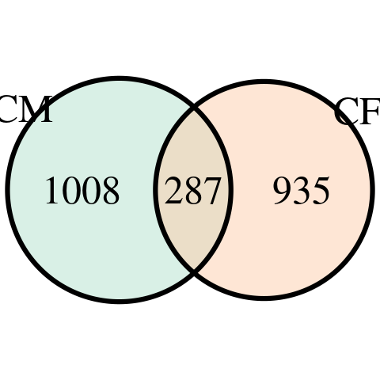

```{r libloader, include=FALSE}
library(tidyverse)
library(qvalue)
library(plotly)
library(patchwork)
library(ggpubr)
library(vroom)
library(RColorBrewer)
library(scales)
library(VennDiagram)
library(gplots)
library(Seurat)
source("code/cell_line_pca.R")
```

```{r}
my_cols <- c("#0077BB", "#70d1d0", "#117733", "#E69F00", "#BF0202", "#9640CE", "#949494")
```

## Bulk Deconvolution
```{r}
cell.types <- c("IPSC", "MES", "CMES", "PROG", "CM", "CF", "UNK")
bulk <- read_tsv("results/cibersort/bulk.inferred.tsv") %>% 
  select(!c(`P-value`, Correlation, RMSE)) %>%
  rename(sample=Mixture) %>%
  gather(!sample, key="type", value="frac") %>% 
  mutate(day=str_extract(sample, "[^_]+$")) %>%
  mutate(ind=str_extract(sample, "[^_]+")) %>%
  mutate(type=factor(type, levels=cell.types)) %>%
  mutate(day=as.numeric(day)) %>%
  mutate(ind=factor(ind)) %>%
  mutate(exp="bulk")

pseudobulk <- read_tsv("results/cibersort/pseudobulk_indday.full.true.tsv") %>% 
  gather(!sample, key="type", value="frac") %>% 
  mutate(day=str_extract(sample, "[^_]+$")) %>%
  mutate(day=str_replace(day, "day", "")) %>%
  mutate(ind=str_extract(sample, "[^_]+")) %>%
  mutate(type=factor(type, levels=cell.types)) %>%
  mutate(day=as.numeric(day)) %>%
  mutate(ind=factor(ind)) %>%
  mutate(exp="pseudobulk")

props <- bind_rows(bulk, pseudobulk) 

ind.subset <- c("19209", "18489", "18505", "18912", "19127", "18508")
ind.subset <- c("18489", "18912", "19127")
props <- bind_rows(bulk, pseudobulk) %>%
  filter(ind %in% ind.subset) %>%
  mutate(ind=factor(ind, levels=ind.subset))

ggplot(props, aes(x=day, y=frac, fill=type)) + 
  geom_area(alpha=1, size=0.5, colour="black") +
  facet_grid(rows=vars(ind), cols=vars(exp)) +
  theme_classic() + theme(axis.ticks.y = element_blank(), axis.text.y=element_blank()) +
  scale_fill_manual(values=my_cols)
```

```{r fig4a, include=FALSE}
fig4a <- ggplot(props, aes(x=day, y=frac, fill=type)) +
  geom_area(alpha=1, size=0.5, colour="black") +
  facet_grid(rows=vars(ind), cols=vars(exp)) +
  theme_classic() + theme(axis.ticks.y = element_blank(), axis.text.y=element_blank()) +
  scale_fill_manual(values=my_cols) +
  xlab("Differentiation Day") + ylab("Cell Type Proportions")
png('figs/fig4/fig4a-poster.png', width=400, height=300)
plot(fig4a)
dev.off()
```

How many hits do we get from interaction eQTLs?
```{r}
count.hits.lfsr <- function(dataset, celltype, ...) {
  nrow(filter(vroom(paste0("results/eqtl_dynamic/ieQTL/", dataset, "/", celltype, "/50k-5clpcs-0pcs-notypes.tophits.tsv")), lfsr<=0.05))
}

count.hits.qval <- function(dataset, celltype, ...) {
  nrow(filter(vroom(paste0("results/eqtl_dynamic/ieQTL/", dataset, "/", celltype, "/50k-5clpcs-0pcs-notypes.tophits.tsv")), qval.unadj<=0.05))
}

celltypes <- c("IPSC", "MES", "CMES", "PROG", "CM", "CF")
hitcounts <- tibble("dataset"=rep("bulk", 6), "celltype"=factor(celltypes, levels=celltypes))
hitcounts$hits <- pmap_dbl(hitcounts, count.hits.qval)
ggplot(hitcounts, aes(x=celltype, y=hits, fill=celltype)) + 
  geom_bar(position="dodge", stat="identity") +
  theme(axis.text.x=element_text(angle=45, hjust=1)) +
  xlab("Cell Type") +
  ylab("Number of Significant ieGenes") +
  scale_fill_manual(values=my_cols[1:6]) +
  theme_classic() +
  theme(legend.position="none")
```

```{r include=FALSE}
fig4b <- ggplot(hitcounts, aes(x=celltype, y=hits, fill=celltype)) + 
  geom_bar(position="dodge", stat="identity") +
  theme(axis.text.x=element_text(angle=45, hjust=1)) +
  xlab("Cell Type") +
  ylab("Number of Significant ieGenes") +
  scale_fill_manual(values=my_cols[1:6]) +
  theme_classic() +
  theme(legend.position="none")
png('figs/fig4/fig4b.png', width=400, height=200)
plot(fig4b)
dev.off()
```

Look at the impact of regressing out cell type proportions
```{r}
count.hits.qval.regtype <- function(dataset, celltype, regtype, ...) {
  nrow(filter(vroom(paste0("results/eqtl_dynamic/ieQTL/", dataset, "/", celltype, "/50k-5clpcs-0pcs-", regtype, ".tophits.tsv")), qval.unadj<=0.05))
}

celltypes <- c("IPSC", "MES", "CMES", "PROG", "CM", "CF")
hitcounts <- tibble("dataset"=rep("bulk", 12), "celltype"=factor(rep(celltypes, 2), levels=celltypes), "regtype"=rep(c("notypes", "regtypes"), each=6))
hitcounts$hits <- pmap_dbl(hitcounts, count.hits.qval.regtype)
hitcounts <- hitcounts %>%
  rowwise() %>%
  mutate(regtype=if_else(regtype=="notypes", F, T))
ggplot(hitcounts, aes(x=celltype, y=hits, fill=regtype)) + 
  geom_bar(position="dodge", stat="identity") +
  theme(axis.text.x=element_text(angle=45, hjust=1)) +
  xlab("Cell Type") +
  ylab("Number of Significant ieGenes") +
  theme_classic() +
  labs(fill="All Cell Type Proportion Covariates Regressed")
```
Compare genotype similarity among top hits before/ after cell type regression
```{r}
dataset <- "bulk"
agg <- "CF"
ieqtls.after <- read_tsv(paste0("results/eqtl_dynamic/ieQTL/", dataset, "/", agg, "/50k-5clpcs-0pcs-regtypes.tophits.tsv")) %>%
  filter(qval.unadj<=0.05) %>%
  mutate(gv=paste(gene, snp, sep="--"))
ieqtls.before <- read_tsv(paste0("results/eqtl_dynamic/ieQTL/", dataset, "/", agg, "/50k-5clpcs-0pcs-notypes.tophits.tsv")) %>%
  filter(qval.unadj<=0.05) %>%
  mutate(gv=paste(gene, snp, sep="--"))

mafs <- vroom("data/geno_maf.tsv")
after.top200 <- ieqtls.after %>% 
  filter(!snp %in% ieqtls.before) %>%
  arrange(qval.unadj) %>% 
  slice_head(n=200) %>% 
  select(gene, snp, gv) %>%
  mutate(group="ieqtl") %>%
  mutate("ct_regressed"=F) %>%
  left_join(mafs, by="snp") %>%
  mutate(maf.bin=floor(maf/0.05))
bin.counts <- bin.counts <- count(after.top200, maf.bin)
after.top200 <- select(after.top200, snp) 
# match MAF for some background variants
set.seed(42)
before.top200 <- ieqtls.before %>%
  left_join(mafs, by="snp")%>%
  mutate(maf.bin=floor(maf/0.05)) %>%
  group_by(maf.bin) %>%
  nest() %>%
  ungroup() %>%
  left_join(bin.counts, by="maf.bin") %>%
  replace_na(list(n=0)) %>%
  mutate(samp=map2(data, n, sample_n)) %>%
  select(!data) %>%
  unnest(samp) %>%
  select(snp)

# get a (nsnps x ncellline) matrix of each individual's genotype at each snp
genotypes <- vroom("data/genotypes.tsv")
after.cor <- genotypes %>% 
  filter(snp %in% after.top200$snp) %>%
  column_to_rownames("snp") %>%
  cor
before.cor <- genotypes %>%
  filter(snp %in% before.top200$snp) %>%
  column_to_rownames("snp") %>%
  cor 

corr.cols <- colorRampPalette(brewer.pal(11, "RdBu"))(25)

png(paste0('figs/supp/ieqtl_corr_regtype_', dataset, '_', agg, '_after.png'), width=800, height=600)
heatmap.2(after.cor, Rowv=T, Colv=T, dendrogram='none', trace='none', col=rev(corr.cols), breaks=seq(-1, 1, length.out=26))
dev.off()

png(paste0('figs/supp/ieqtl_corr_regtype_', dataset, '_', agg, '_before.png'), width=800, height=600)
heatmap.2(before.cor, Rowv=T, Colv=T, dendrogram='none', trace='none', col=rev(corr.cols), breaks=seq(-1, 1, length.out=26))
dev.off()

```


Look at the impact of regressing out sample PCs
```{r}
count.hits.lfsr.pc <- function(dataset, celltype, npc, ...) {
  nrow(filter(vroom(paste0("results/eqtl_dynamic/ieQTL/", dataset, "/", celltype, "/50k-5clpcs-", npc, "pcs-notypes.tophits.tsv")), lfsr<=0.05))
}

count.hits.qval.pc <- function(dataset, celltype, npc, ...) {
  nrow(filter(vroom(paste0("results/eqtl_dynamic/ieQTL/", dataset, "/", celltype, "/50k-5clpcs-", npc, "pcs-notypes.tophits.tsv")), qval.unadj<=0.05))
}

celltypes <- c("IPSC", "MES", "CMES", "PROG", "CM", "CF")
hitcounts <- tibble("dataset"=rep("bulk", 30), "celltype"=factor(rep(celltypes, 5), levels=celltypes), "npc"=rep(c(0, 5, 10, 20, 30), each=6))
hitcounts$hits <- pmap_dbl(hitcounts, count.hits.lfsr.pc) 
hitcounts <- hitcounts %>%
  mutate(npc=factor(npc, levels=c(0, 5, 10, 20, 30)))
ggplot(hitcounts, aes(x=celltype, y=hits, fill=npc)) + 
  geom_bar(position="dodge", stat="identity") +
  theme(axis.text.x=element_text(angle=45, hjust=1)) +
  xlab("Cell Type") +
  ylab("Number of Significant ieGenes") +
  theme_classic() +
  labs(fill="Sample PCs Regressed Out")
```

Compare genotype similarity among top hits before/ after cell type regression
```{r}
dataset <- "bulk"
agg <- "CF"

ieqtls.before <- read_tsv(paste0("results/eqtl_dynamic/ieQTL/", dataset, "/", agg, "/50k-5clpcs-0pcs-notypes.tophits.tsv")) %>%
  filter(qval.unadj<=0.05) %>%
  mutate(gv=paste(gene, snp, sep="--"))
genotypes <- vroom("data/genotypes.tsv")

npc <- 30
ieqtls.after <- read_tsv(paste0("results/eqtl_dynamic/ieQTL/", dataset, "/", agg, "/50k-5clpcs-", npc, "pcs-notypes.tophits.tsv")) %>%
  filter(qval.unadj<=0.05) %>%
  mutate(gv=paste(gene, snp, sep="--"))

mafs <- vroom("data/geno_maf.tsv")
after.top200 <- ieqtls.after %>% 
  filter(!snp %in% ieqtls.before) %>%
  arrange(qval.unadj) %>% 
  slice_head(n=200) %>% 
  select(gene, snp, gv) %>%
  mutate(group="ieqtl") %>%
  mutate("ct_regressed"=F) %>%
  left_join(mafs, by="snp") %>%
  mutate(maf.bin=floor(maf/0.05))
bin.counts <- bin.counts <- count(after.top200, maf.bin)
after.top200 <- select(after.top200, snp) 
# match MAF for some background variants
set.seed(42)
before.top200 <- ieqtls.before %>%
  left_join(mafs, by="snp")%>%
  mutate(maf.bin=floor(maf/0.05)) %>%
  group_by(maf.bin) %>%
  nest() %>%
  ungroup() %>%
  left_join(bin.counts, by="maf.bin") %>%
  replace_na(list(n=0)) %>%
  mutate(samp=map2(data, n, sample_n)) %>%
  select(!data) %>%
  unnest(samp) %>%
  select(snp)

# get a (nsnps x ncellline) matrix of each individual's genotype at each snp
after.cor <- genotypes %>% 
  filter(snp %in% after.top200$snp) %>%
  column_to_rownames("snp") %>%
  cor
before.cor <- genotypes %>%
  filter(snp %in% before.top200$snp) %>%
  column_to_rownames("snp") %>%
  cor 

corr.cols <- colorRampPalette(brewer.pal(11, "RdBu"))(25)

png(paste0('figs/supp/ieqtl_corr_regtype_', dataset, '_', agg, '_after_', npc, '.png'), width=800, height=600)
heatmap.2(after.cor, Rowv=T, Colv=T, dendrogram='none', trace='none', col=rev(corr.cols), breaks=seq(-1, 1, length.out=26))
dev.off()

png(paste0('figs/supp/ieqtl_corr_regtype_', dataset, '_', agg, '_before_', npc, '.png'), width=800, height=600)
heatmap.2(before.cor, Rowv=T, Colv=T, dendrogram='none', trace='none', col=rev(corr.cols), breaks=seq(-1, 1, length.out=26))
dev.off()

```

How much overlap is there between CM and CF hits?
```{r}
cm.iegenes <- read_tsv("results/eqtl_dynamic/ieQTL/bulk/CM/50k-5clpcs-0pcs-notypes.tophits.tsv") %>% filter(qval.unadj<=0.05) %>% .$gene
cf.iegenes <- read_tsv("results/eqtl_dynamic/ieQTL/bulk/CF/50k-5clpcs-0pcs-notypes.tophits.tsv") %>% filter(qval.unadj<=0.05) %>% .$gene

venn.diagram(
  x = list(cm.iegenes, cf.iegenes),
  category.names = c("CM", "CF"),
  filename = 'figs/intx.cm.cf.overlap.png',
  output=TRUE,
  imagetype="png" ,
  height = 480 , 
  width = 480 , 
  resolution = 300,
  compression = "lzw",
  fill=brewer.pal(3, "Pastel2")[1:2]
)
```



Load genotype data
```{r}
genotypes <- vroom("data/genotypes.tsv")
genodict <- vroom("data/YRI.hg38.filtered.tsv", col_select=c("#CHROM", "POS", "REF", "ALT", "ID")) %>%
  mutate(snp=paste(`#CHROM`, POS, sep="_"), .keep="unused")
```

Load expression data and cell type proportions
```{r}

```

Look at an example of a lineage-specific ieQTL in both lineages
```{r}

expression <- vroom("data/bulk/day/logtpm.tsv") %>% 
  column_to_rownames("gene") %>% 
  apply(1, center.scale) %>% t %>% as_tibble(rownames="gene")
proportions <- vroom("results/cibersort/bulk.inferred.tsv") %>% 
  select(c(Mixture, CM, CF)) %>%
  rename(sample=Mixture)

cm.hits <- vroom("results/eqtl_dynamic/ieQTL/bulk/CM/50k-5clpcs-0pcs-notypes.tophits.tsv") %>% filter(qval.unadj<=0.05) %>% select(gene, snp, bonf.p.unadj) %>% arrange(bonf.p.unadj) %>% mutate(celltype="CM")
cf.hits <- vroom("results/eqtl_dynamic/ieQTL/bulk/CF/50k-5clpcs-0pcs-notypes.tophits.tsv") %>% filter(qval.unadj<=0.05) %>% select(gene, snp, bonf.p.unadj) %>% mutate(celltype="CF")
cm.hits <- filter(cm.hits, !snp %in% cf.hits$snp) %>% arrange(bonf.p.unadj) %>% select(!bonf.p.unadj)
cf.hits <- filter(cf.hits, !gene %in% cm.hits$gene) %>% arrange(bonf.p.unadj) %>% select(!bonf.p.unadj)

ieqtl_info <- function(egene, evariant, ...) {
  ieqtl_ind = filter(genotypes, snp==evariant) %>%
    pivot_longer(cols=starts_with("1"), names_to="ind", values_to="genotype") %>%
    mutate(genotype=factor(round(genotype), levels=sort(unique(round(genotype)))))
  ieqtl_sample = expression %>% filter(gene == egene) %>%
    column_to_rownames("gene") %>% t %>% as_tibble(rownames="sample") %>%
    inner_join(proportions, by="sample") %>%
    mutate(ind=str_sub(sample, 1, 5)) %>%
    pivot_longer(cols=setdiff(colnames(.), c("sample", "CM", "CF", "ind")), names_to="gene", values_to="expression") %>%
    select(!sample)
  
  ieqtl = inner_join(ieqtl_sample, ieqtl_ind, by="ind")
  ieqtl
}

```

Write a function to replace genotype dosage with alleles
```{r}
dosage2geno <- function(evariant, genotype, ..., genodict.snp) {
  ref <- genodict.snp$REF
  alt <- genodict.snp$ALT
  if (genotype == "0") {
    geno = paste0(ref, ref)
  } else if (genotype == "1") {
    geno = paste0(ref, alt)
  } else {
    geno = paste0(alt, alt)
  }
  geno
}
```


```{r}

cm.qtl <- cm.hits %>% 
  filter(gene=="CMYA5") %>% 
  rename(egene = gene) %>% 
  rename(evariant=snp) %>% 
  pmap_df(.l=., .f=ieqtl_info) %>% 
  rename(evariant=snp) %>% 
  mutate(genotype=as.character(genotype)) %>% 
  mutate(geno=pmap_chr(., .f=dosage2geno, genodict.snp=filter(genodict, snp==.$evariant[1]))) %>%
  rename(Genotype=geno)
i=16
p <- viz_residuals_ieqtl(cm.hits$gene[i], cm.hits$snp[i], "CM", ctreg=F)
ggplot(cm.qtl, aes(x=CM, y=expression, color=Genotype))+
  geom_point() + 
  ylab(cm.qtl$gene) +
  xlab("Percent CM") +
  ggtitle(filter(genodict, snp==cm.qtl$evariant[1])$ID) +
  theme_classic() +
  geom_smooth(method="lm")
ggplot(cm.qtl, aes(x=CF, y=expression, color=Genotype))+
  geom_point() + 
  ylab(cm.qtl$gene) +
  xlab("Percent CM") +
  ggtitle(filter(genodict, snp==cm.qtl$evariant[1])$ID) +
  theme_classic() +
  geom_smooth(method="lm")
```

```{r include=FALSE}
fig4c <- ggplot(cm.qtl, aes(x=CM, y=expression, color=Genotype))+
  geom_point() + 
  ylab(cm.qtl$gene) +
  xlab("Percent CM") +
  ggtitle(filter(genodict, snp==cm.qtl$evariant[1])$ID) +
  theme_classic() +
  geom_smooth(method="lm") +
  scale_color_manual(values=c("#038EDC", "#E63434"))
png('figs/fig4/fig4c.png', width=400, height=200)
plot(fig4c)
dev.off()

fig4d <- ggplot(cm.qtl, aes(x=CF, y=expression, color=Genotype))+
  geom_point() + 
  ylab(cm.qtl$gene) +
  xlab("Percent CF") +
  ggtitle(filter(genodict, snp==cm.qtl$evariant[1])$ID) +
  theme_classic() +
  geom_smooth(method="lm") +
  scale_color_manual(values=c("#038EDC", "#E63434"))
png('figs/fig4/fig4d.png', width=400, height=200)
plot(fig4d)
dev.off()
```

```{r}
cf.qtl <- cf.hits %>% filter(gene=="MMP10") %>% rename(egene = gene) %>% rename(evariant=snp) %>% pmap_df(.l=., .f=ieqtl_info)

ggplot(cf.qtl, aes(x=CM, y=expression, color=genotype))+
  geom_point() + 
  ylab(cf.qtl$gene) +
  theme_classic() +
  geom_smooth(method="lm")
ggplot(cf.qtl, aes(x=CF, y=expression, color=genotype))+
  geom_point() + 
  ylab(cf.qtl$gene) +
  theme_classic() +
  geom_smooth(method="lm")
```

How many of the egenes we detect as CM-ieQTLs are also picked up as dynamic eQTLs?
```{r}
cm.ieqtl <- vroom("results/eqtl_dynamic/ieQTL/bulk/CM/50k-5clpcs-0pcs-notypes.tophits.tsv") %>% filter(qval.unadj<=0.05) %>% .$gene
bulk.dynqtl <- vroom("results/eqtl_dynamic/linear_dQTL/bulk/day/50k-5clpcs-0pcs-notypes.tophits.tsv") %>% filter(qval.unadj<=0.05) %>% .$gene
pbcm.dynqtl <- vroom("results/eqtl_dynamic/linear_dQTL/pseudobulk-cm/bin16/50k-5clpcs-0pcs-notypes.tophits.tsv") %>% filter(qval.unadj<=0.05) %>% .$gene
```

```{r}
length(intersect(cm.ieqtl, bulk.dynqtl))
```

How many of the CM ieQTL's are also pseudobulk dynamic eQTLs?
```{r}
length(intersect(cm.ieqtl, pbcm.dynqtl))
```

How many of the CM ieQTLs that are also pseudobulk dynamic eQTLs get missed by bulk dynamic eqtl?
```{r}
length(setdiff(intersect(cm.ieqtl, pbcm.dynqtl), bulk.dynqtl))
```

What are those genes, any good ones?
```{r}
setdiff(intersect(cm.ieqtl, pbcm.dynqtl), bulk.dynqtl)
```

```{r}
cm.qtl <- cm.hits %>% filter(gene=="VWDE") %>% rename(egene = gene) %>% rename(evariant=snp) %>% pmap_df(.l=., .f=ieqtl_info)

ggplot(cm.qtl, aes(x=CM, y=expression, color=genotype))+
  geom_point() + 
  ylab(cm.qtl$gene) +
  theme_classic() +
  geom_smooth(method="lm")
ggplot(cm.qtl, aes(x=CF, y=expression, color=genotype))+
  geom_point() + 
  ylab(cm.qtl$gene) +
  theme_classic() +
  geom_smooth(method="lm")
```


