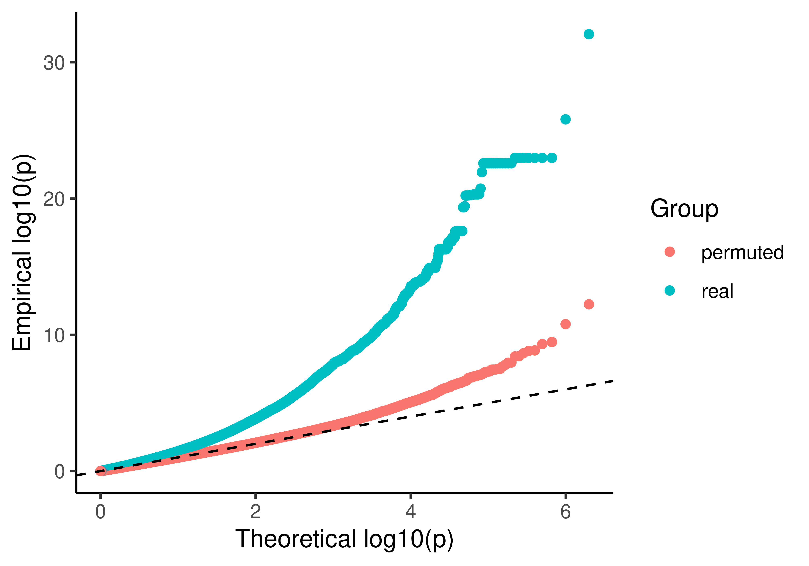

```{r}
suppressPackageStartupMessages(
c(library("tidyverse"),
library("vroom"))
)
```

# Permutation Analysis - First Approach
Here, we permute the full (nsamples=ncelllines*ndays) time column within the interaction term, so we don't maintain any structure 
```{r echo=FALSE, warning=FALSE, message=FALSE}
dataset<-"bulk7"
agg<-"day"
 
plot_permutations <- function (dataset, agg, ...) {
  real.p <- vroom(paste0("../results/eqtl_dynamic/linear_dQTL/", dataset, "/", agg, "/50k-5clpcs-0pcs-notypes.mtc.tsv")) %>%
    select(p.unadj) %>% 
    arrange(p.unadj) %>% 
    rename(p.real=p.unadj) %>% 
    rowid_to_column()
  permute.p <- vroom(paste0("../results/eqtl_dynamic/linear_dQTL/", dataset, "/", agg, "/50k-5clpcs-0pcs-notypes.mtc.permuted.tsv")) %>%
    select(p.unadj) %>% 
    arrange(p.unadj) %>% 
    rename(p.permuted=p.unadj) %>%
    rowid_to_column() %>%
    right_join(real.p, by="rowid") %>%
    mutate(p.null=rowid/nrow(.), .keep="unused") %>%
    mutate(across(starts_with("p."), (function(x){-log10(x)}))) %>%
    pivot_longer(cols=c(p.real, p.permuted), names_to="group", values_to="p") %>%
    mutate(group=str_extract(group, "[^.]+$"))
  p <- ggplot(permute.p, aes(x=p.null, y=p, color=group)) +
    geom_point() +
    geom_abline(slope=1, intercept=0, linetype="dashed")
}

ggsave(
  paste0("../figs/supp/perm1_bulk.png"),
  plot_permutations("bulk", "day"),
  width = 5,
  height = 3.5,
  dpi = 800
)

ggsave(
  paste0("../figs/supp/perm1_cm.png"),
  plot_permutations("pseudobulk-cf", "bin16"),
  width = 5,
  height = 3.5,
  dpi = 800
)

ggsave(
  paste0("../figs/supp/perm1_cf.png"),
  plot_permutations("pseudobulk-cm", "bin16"),
  width = 5,
  height = 3.5,
  dpi = 800
)
```




```{r echo=FALSE, warning=FALSE, message=FALSE}
dataset<-"pseudobulk-cm"
agg<-"bin15"
real.p <- vroom(paste0("../results/eqtl_dynamic/linear_dQTL/", dataset, "/", agg, "/50k-5clpcs-0pcs-notypes.mtc.tsv")) %>%
  select(p.unadj) %>% 
  arrange(p.unadj) %>% 
  rename(p.real=p.unadj) %>% 
  rowid_to_column()
permute.p <- vroom(paste0("../results/eqtl_dynamic/linear_dQTL/", dataset, "/", agg, "/50k-5clpcs-0pcs-notypes.mtc.permuted2.tsv")) %>%
  select(p.unadj, tau) %>% 
  arrange(p.unadj) %>% 
  rename(p.permuted=p.unadj) %>%
  rowid_to_column() %>%
  right_join(real.p, by="rowid") %>%
  mutate(p.null=rowid/nrow(.), .keep="unused") %>%
  mutate(across(starts_with("p."), (function(x){-log10(x)}))) %>%
  arrange(abs(tau)) %>%
  rowid_to_column("tau.rank") %>%
  mutate(day.similarity=cut(tau.rank, 4, labels=c("low", "med-low", "med-high", "high"))) %>%
  pivot_longer(cols=c(p.real, p.permuted), names_to="group", values_to="p") %>%
  mutate(group=str_extract(group, "[^.]+$"))

p <- ggplot(permute.p, aes(x=p.null, y=p, color=group)) +
  geom_point() +
  facet_grid(cols=vars(day.similarity)) +
  geom_abline(slope=1, intercept=0, linetype="dashed")
ggsave(
  paste0("../figs/perm2.", dataset, ".", agg, ".png"),
  p,
  width = 10,
  height = 3.5,
  dpi = 800
)
```


```{r}
dataset<-"pseudobulk-cf"
agg<-"bin15"
real.p <- vroom(paste0("../results/eqtl_dynamic/linear_dQTL/", dataset, "/", agg, "/50k-5clpcs-0pcs-notypes.mtc.tsv")) %>%
  select(p.unadj) %>% 
  arrange(p.unadj) %>% 
  rename(p.real=p.unadj) %>% 
  rowid_to_column()
permute.p <- vroom(paste0("../results/eqtl_dynamic/linear_dQTL/", dataset, "/", agg, "/50k-5clpcs-0pcs-notypes.mtc.permuted3.tsv")) %>%
  select(p.unadj, tau) %>% 
  arrange(p.unadj) %>% 
  rename(p.permuted=p.unadj) %>%
  rowid_to_column() %>%
  right_join(real.p, by="rowid") %>%
  mutate(p.null=rowid/nrow(.), .keep="unused") %>%
  mutate(across(starts_with("p."), (function(x){-log10(x)}))) %>%
  arrange(abs(tau)) %>%
  rowid_to_column("tau.rank") %>%
  mutate(day.similarity=cut(tau.rank, 4, labels=c("low", "med-low", "med-high", "high"))) %>%
  pivot_longer(cols=c(p.real, p.permuted), names_to="group", values_to="p") %>%
  mutate(group=str_extract(group, "[^.]+$"))

p <- ggplot(permute.p, aes(x=p.null, y=p, color=group)) +
  geom_point() +
  facet_grid(cols=vars(day.similarity)) +
  geom_abline(slope=1, intercept=0, linetype="dashed")
ggsave(
  paste0("../figs/perm3.", dataset, ".", agg, ".png"),
  p,
  width = 10,
  height = 3.5,
  dpi = 800
)
```


Do we get more hits from highly variable features? This could be due to cell type specific expression of those genes, but could also potentially indicate that we're running into double dipping issues since they're used to compute pseudotime
```{r}
sc_cm <- readRDS("../data/seurat.cm.rds")
hvf <- rownames(sc_cm@assays$SCT@scale.data)

dataset<-"bulk"
agg<-"day"
real.p <- vroom(paste0("../results/eqtl_dynamic/linear_dQTL/", dataset, "/", agg, "/50k-5clpcs-0pcs-notypes.mtc.tsv")) %>%
  select(p.unadj, gene) %>% 
  mutate(hvf=gene %in% hvf) %>%
  arrange(p.unadj) %>% 
  rename(p.real=p.unadj) %>% 
  rowid_to_column() %>%
  mutate(p.null=rowid/nrow(.), .keep="unused") %>%
  mutate(across(starts_with("p."), (function(x){-log10(x)})))

p <- ggplot(real.p, aes(x=p.null, y=p.real, color=hvf)) +
  geom_point() +
  geom_abline(slope=1, intercept=0, linetype="dashed")

ggsave(
  paste0("../figs/hvf.", dataset, ".", agg, ".png"),
  p,
  width = 5,
  height = 3.5,
  dpi = 800
)
```


