```{r}
suppressPackageStartupMessages(
c(library("tidyverse"),
library("vroom"),
library("patchwork"))
)
```

# Permutation Analysis - First Approach
Here, we permute the full (nsamples=ncelllines*ndays) time column within the interaction term, so we don't maintain any structure 
```{r echo=FALSE, warning=FALSE, message=FALSE}
dataset<-"bulk"
agg<-"day"
 
plot_permutations <- function (dataset, agg, ...) {
  real.p <- vroom(paste0("../results/eqtl_dynamic/linear_dQTL/", dataset, "/", agg, "/50k-5clpcs-0pcs-notypes.mtc.tsv")) %>%
    select(p.unadj) %>% 
    arrange(p.unadj) %>% 
    rename(p.real=p.unadj) %>% 
    rowid_to_column()
  permute.p <- vroom(paste0("../results/eqtl_dynamic/linear_dQTL/", dataset, "/", agg, "/50k-5clpcs-0pcs-notypes.mtc.permuted.tsv")) %>%
    select(p.unadj) %>% 
    arrange(p.unadj) %>% 
    rename(p.permuted=p.unadj) %>%
    rowid_to_column() %>%
    right_join(real.p, by="rowid") %>%
    mutate(p.null=rowid/nrow(.), .keep="unused") %>%
    mutate(across(starts_with("p."), (function(x){-log10(x)}))) %>%
    pivot_longer(cols=c(p.real, p.permuted), names_to="group", values_to="p") %>%
    mutate(group=str_extract(group, "[^.]+$"))
  p <- ggplot(permute.p, aes(x=p.null, y=p, color=group)) +
    geom_point() +
    geom_abline(slope=1, intercept=0, linetype="dashed") + 
    labs(color="Group") + 
    ylab("Empirical log10(p)") +
    xlab("Theoretical log10(p)") +
    theme_classic()
}

ggsave(
  paste0("../figs/supp/perm1_bulk.png"),
  plot_permutations("bulk", "day"),
  width = 5,
  height = 3.5,
  dpi = 800
)

ggsave(
  paste0("../figs/supp/perm1_cf.png"),
  plot_permutations("pseudobulk-cf", "bin16"),
  width = 5,
  height = 3.5,
  dpi = 800
)

ggsave(
  paste0("../figs/supp/perm1_cm.png"),
  plot_permutations("pseudobulk-cm", "bin16"),
  width = 5,
  height = 3.5,
  dpi = 800
)
```

# 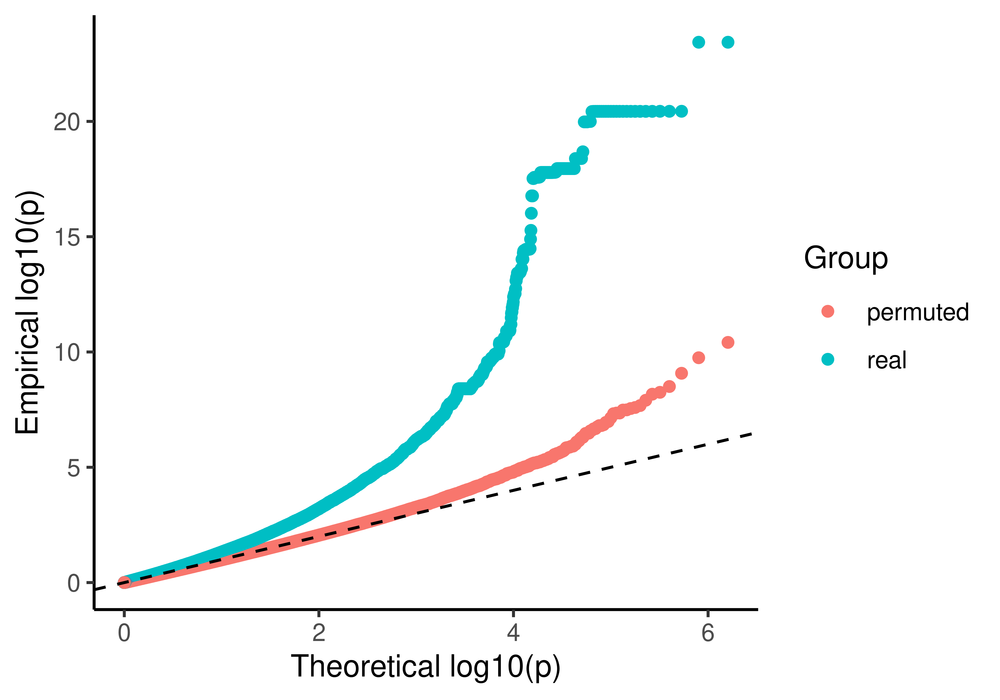

# 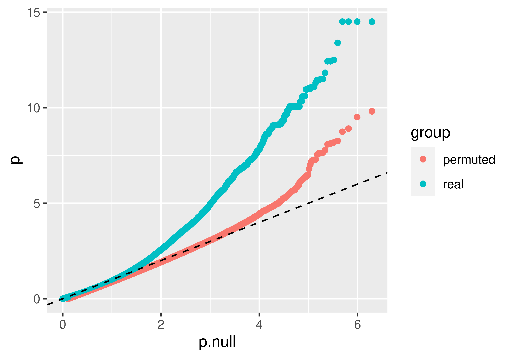

# 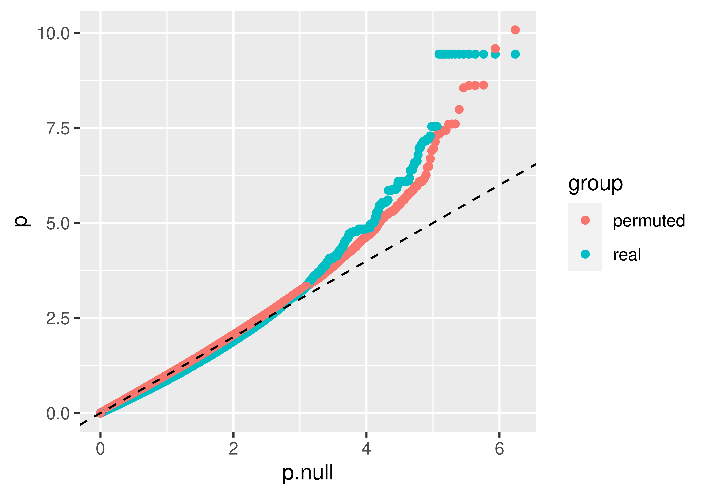

# 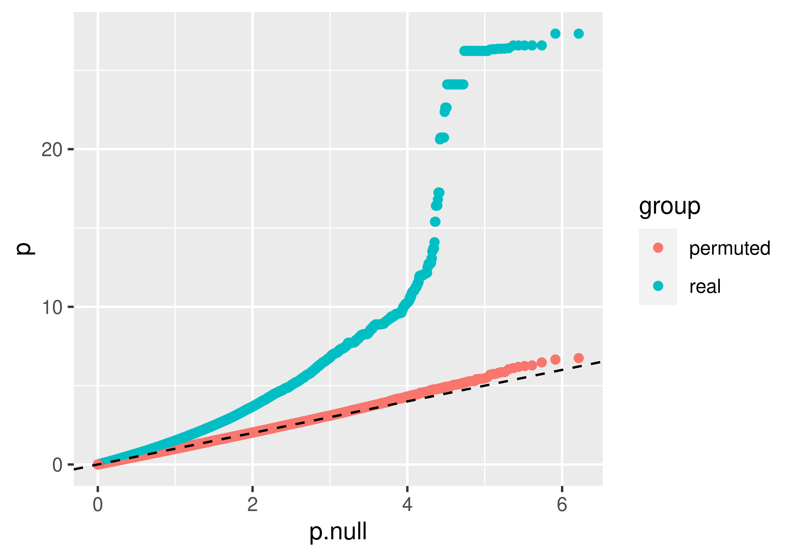

# 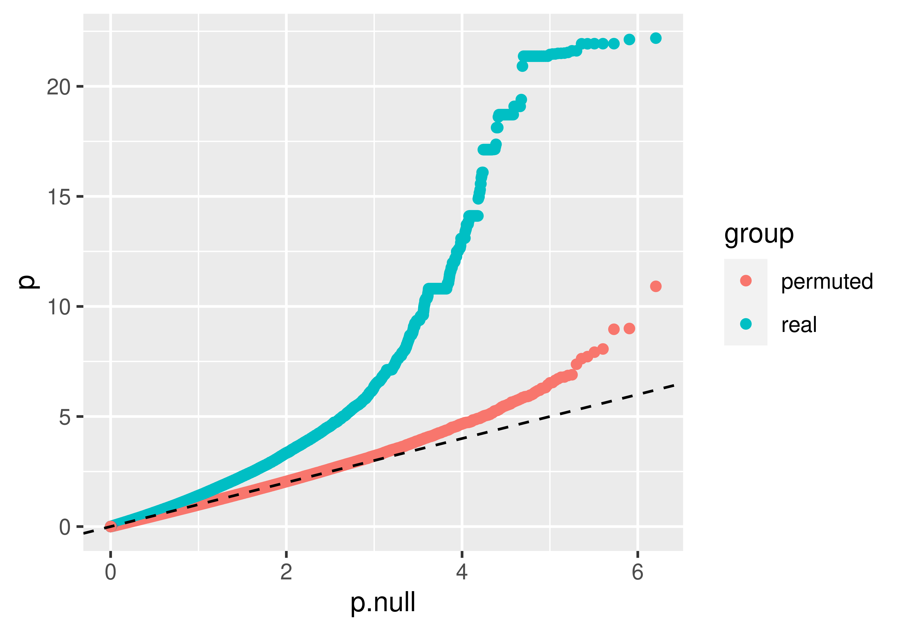

```{r echo=FALSE, warning=FALSE, message=FALSE}
dataset<-"pseudobulk-cm"
agg<-"bin15"
real.p <- vroom(paste0("../results/eqtl_dynamic/linear_dQTL/", dataset, "/", agg, "/50k-5clpcs-0pcs-notypes.mtc.tsv")) %>%
  select(p.unadj) %>% 
  arrange(p.unadj) %>% 
  rename(p.real=p.unadj) %>% 
  rowid_to_column()
permute.p <- vroom(paste0("../results/eqtl_dynamic/linear_dQTL/", dataset, "/", agg, "/50k-5clpcs-0pcs-notypes.mtc.permuted2.tsv")) %>%
  select(p.unadj, tau) %>% 
  arrange(p.unadj) %>% 
  rename(p.permuted=p.unadj) %>%
  rowid_to_column() %>%
  right_join(real.p, by="rowid") %>%
  mutate(p.null=rowid/nrow(.), .keep="unused") %>%
  mutate(across(starts_with("p."), (function(x){-log10(x)}))) %>%
  arrange(abs(tau)) %>%
  rowid_to_column("tau.rank") %>%
  mutate(day.similarity=cut(tau.rank, 4, labels=c("low", "med-low", "med-high", "high"))) %>%
  pivot_longer(cols=c(p.real, p.permuted), names_to="group", values_to="p") %>%
  mutate(group=str_extract(group, "[^.]+$"))

p <- ggplot(permute.p, aes(x=p.null, y=p, color=group)) +
  geom_point() +
  facet_grid(cols=vars(day.similarity)) +
  geom_abline(slope=1, intercept=0, linetype="dashed")
ggsave(
  paste0("../figs/perm2.", dataset, ".", agg, ".png"),
  p,
  width = 10,
  height = 3.5,
  dpi = 800
)
```
# 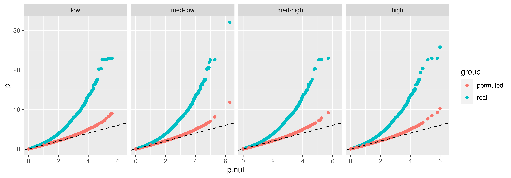

# 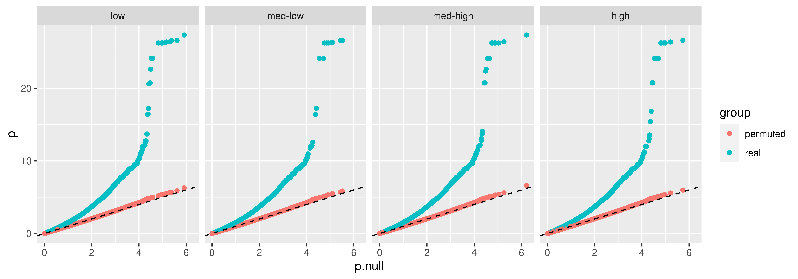

# 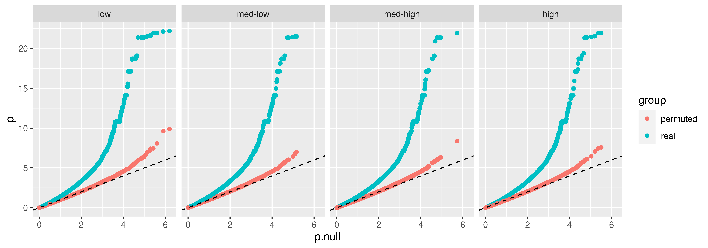

```{r}
dataset<-"pseudobulk-cf"
agg<-"bin15"
real.p <- vroom(paste0("../results/eqtl_dynamic/linear_dQTL/", dataset, "/", agg, "/50k-5clpcs-0pcs-notypes.mtc.tsv")) %>%
  select(p.unadj) %>% 
  arrange(p.unadj) %>% 
  rename(p.real=p.unadj) %>% 
  rowid_to_column()
permute.p <- vroom(paste0("../results/eqtl_dynamic/linear_dQTL/", dataset, "/", agg, "/50k-5clpcs-0pcs-notypes.mtc.permuted3.tsv")) %>%
  select(p.unadj, tau) %>% 
  arrange(p.unadj) %>% 
  rename(p.permuted=p.unadj) %>%
  rowid_to_column() %>%
  right_join(real.p, by="rowid") %>%
  mutate(p.null=rowid/nrow(.), .keep="unused") %>%
  mutate(across(starts_with("p."), (function(x){-log10(x)}))) %>%
  arrange(abs(tau)) %>%
  rowid_to_column("tau.rank") %>%
  mutate(day.similarity=cut(tau.rank, 4, labels=c("low", "med-low", "med-high", "high"))) %>%
  pivot_longer(cols=c(p.real, p.permuted), names_to="group", values_to="p") %>%
  mutate(group=str_extract(group, "[^.]+$"))

p <- ggplot(permute.p, aes(x=p.null, y=p, color=group)) +
  geom_point() +
  facet_grid(cols=vars(day.similarity)) +
  geom_abline(slope=1, intercept=0, linetype="dashed")
ggsave(
  paste0("../figs/perm3.", dataset, ".", agg, ".png"),
  p,
  width = 10,
  height = 3.5,
  dpi = 800
)
```
# 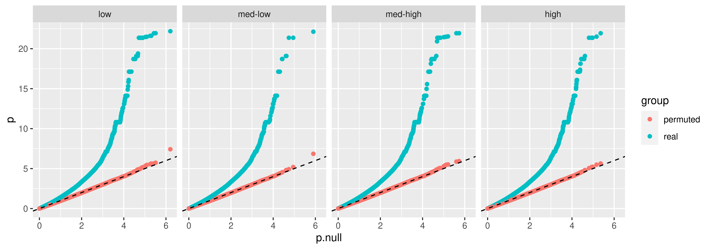

# 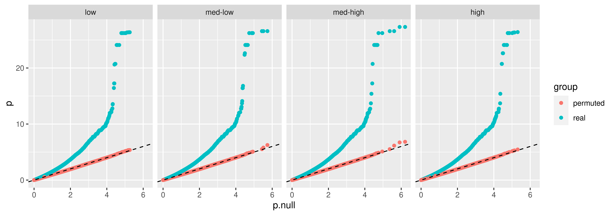

Do we get more hits from highly variable features? This could be due to cell type specific expression of those genes, but could also potentially indicate that we're running into double dipping issues since they're used to compute pseudotime
```{r}
sc_cm <- readRDS("../data/seurat.cm.rds")
hvf <- rownames(sc_cm@assays$SCT@scale.data)

dataset<-"bulk"
agg<-"day"
real.p <- vroom(paste0("../results/eqtl_dynamic/linear_dQTL/", dataset, "/", agg, "/50k-5clpcs-0pcs-notypes.mtc.tsv")) %>%
  select(p.unadj, gene) %>% 
  mutate(hvf=gene %in% hvf) %>%
  arrange(p.unadj) %>% 
  rename(p.real=p.unadj) %>% 
  rowid_to_column() %>%
  mutate(p.null=rowid/nrow(.), .keep="unused") %>%
  mutate(across(starts_with("p."), (function(x){-log10(x)})))

p <- ggplot(real.p, aes(x=p.null, y=p.real, color=hvf)) +
  geom_point() +
  geom_abline(slope=1, intercept=0, linetype="dashed")

ggsave(
  paste0("../figs/hvf.", dataset, ".", agg, ".png"),
  p,
  width = 5,
  height = 3.5,
  dpi = 800
)
```

# 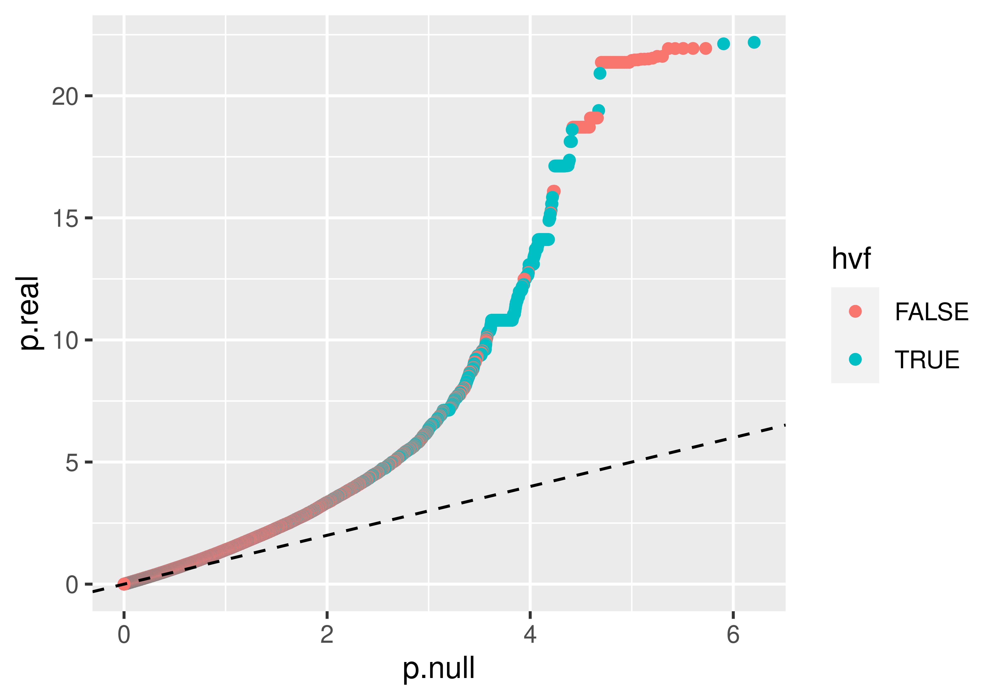

# 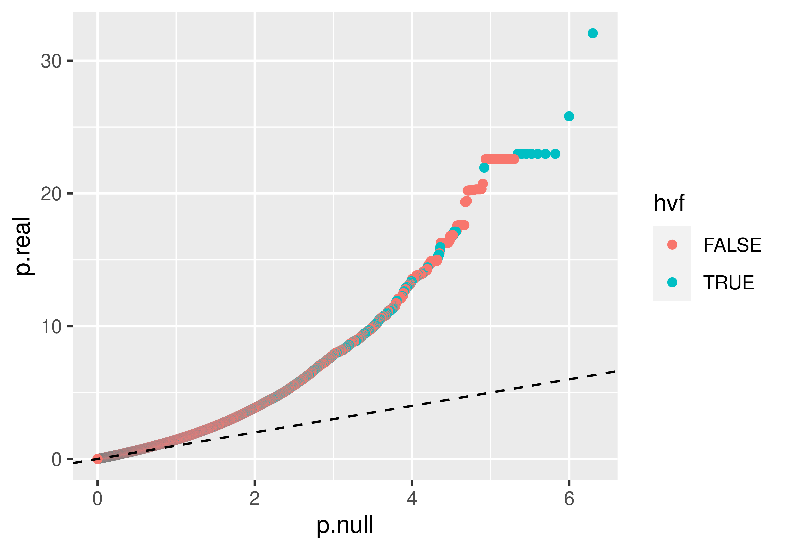


## Permute pseudotime across all cells
```{r}
emp.p <- vroom("../results/eqtl_dynamic/linear_dQTL/permuted_cells/pseudobulk-cm/bin16/50k-5clpcs-0pcs-notypes.emp_pvals.tsv")

hist_pooled <- ggplot(tibble("p"=emp.p$pooled), aes(x=p)) +
  geom_histogram() + 
  xlab("P") + ggtitle("Empirical Null P-value Distribution with Pooling") +
  theme_classic(base_size=20)

hist_unpooled <- ggplot(tibble("p"=emp.p$unpooled), aes(x=p)) +
  geom_histogram() + 
  xlab("P") + ggtitle("Empirical Null P-value Distribution without Pooling") +
  theme_classic(base_size=20)

obs.p <- vroom("../results/eqtl_dynamic/linear_dQTL/pseudobulk-cm/bin16/50k-5clpcs-0pcs-notypes.mtc.tsv",
               col_select=c(p.unadj))
hist_obs <- ggplot(tibble("p"=obs.p$p.unadj), aes(x=p)) +
  geom_histogram() + 
  xlab("P") + ggtitle("Observed P-value Distribution") +
  theme_classic(base_size=20)

png('figs/supp/permutecells.png', width=1000, height=400)
hist_pooled + hist_unpooled + hist_obs
dev.off()
```
# 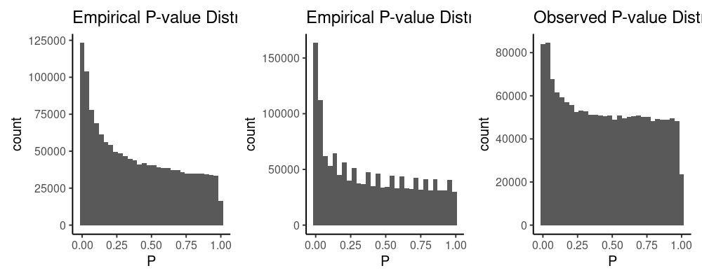

QQ plot
```{r}
obs.t <- vroom("../results/eqtl_dynamic/linear_dQTL/pseudobulk-cm/bin16/50k-5clpcs-0pcs-notypes.mtc.tsv",
               col_select=c(gene, snp, t.unadj)) %>%
  unite("gv", gene, snp, sep="--") %>%
  filter(gv %in% paste0(merge_samples$gene, "--", merge_samples$snp))

qq <- tibble(obs=quantile(obs.t$t.unadj, probs=seq(0.01, 0.99, 0.01)),
             emp=quantile(as.vector(perm_tstats), probs=seq(0.01, 0.99, 0.01)),
             theor=qt(seq(0.01, 0.99, 0.01), df=300)) %>%
  pivot_longer(!theor, names_to="dist", values_to="t_obs")

ggplot(qq, aes(x=theor, y=t_obs, color=dist)) +
  geom_point() +
  geom_abline(slope=1, intercept=0, linetype="dashed")
```

Look at some of the key parameters that will influence $\textrm{var}(\hat{\beta}_{G*t})$
```{r}
t_bulk <- read_tsv("../data/bulk/day/logtpm.tsv", n_max=0) %>%
  column_to_rownames("gene") %>%
  t %>% as_tibble(rownames="binind") %>%
  mutate(t=as.numeric(str_extract(binind, "[^_]+$")))

cm_drop <- read_tsv("../data/pseudobulk-cm/bin16/dropped_samples.tsv")
t_cm <- read_tsv("../results/eqtl_dynamic/linear_dQTL/pseudobulk-cm/bin16/bin_medians.tsv") %>%
  filter(!binind %in% cm_drop$sample)

cf_drop <- read_tsv("../data/pseudobulk-cf/bin16/dropped_samples.tsv")
t_cf <- read_tsv("../results/eqtl_dynamic/linear_dQTL/pseudobulk-cf/bin16/bin_medians.tsv") %>%
  filter(!binind %in% cf_drop$sample)
```

Visualize the cumulative distributions for the different approaches to hypothesis testing 
```{r}
cm_results_permute <- vroom("../results/eqtl_dynamic/linear_dQTL/permuted_cells/pseudobulk-cm/bin16/50k-5clpcs-0pcs-notypes.mtc.tsv") %>%
  unite(gv, gene, snp, sep="--", remove=F)
cf_results_permute <- vroom("../results/eqtl_dynamic/linear_dQTL/permuted_cells/pseudobulk-cf/bin16/50k-5clpcs-0pcs-notypes.mtc.tsv") %>%
  unite(gv, gene, snp, sep="--", remove=F)

cm_pcomp <- ggplot(sample_n(cm_results_permute, 100000), aes(x=-log10(p.unadj), y=-log10(emp.pvals))) +
  geom_point() +
  theme_classic(base_size=14) +
  xlab("-log10(p.nominal)") + ylab("-log10(p.empirical)") +
  xlim(c(0, 5)) +
  geom_abline(aes(slope=1, intercept=0), linetype="dashed", color="red") +
  ggtitle("Cardiomyocyte lineage")
# cm_hist1 <- ggplot(cm_results_permute, aes(x=emp.pvals)) +
#   geom_histogram(bins=20) +
#   theme_classic(base_size=14) +
#   xlab("p.empirical")
# cm_hist2 <- ggplot(cm_results_permute, aes(x=p.unadj)) +
#   geom_histogram(bins=20) +
#   theme_classic(base_size=14) +
#   xlab("p.nominal")
# 
cf_pcomp <- ggplot(sample_n(cf_results_permute, 100000), aes(x=-log10(p.unadj), y=-log10(emp.pvals))) +
  geom_point() +
  theme_classic(base_size=14) +
  xlim(c(0, 5)) +
  xlab("-log10(p.nominal)") + ylab("-log10(p.empirical)") +
  geom_abline(aes(slope=1, intercept=0), linetype="dashed", color="red") +
  ggtitle("Cardiac fibroblast lineage")
# cf_hist1 <- ggplot(cf_results_permute, aes(x=emp.pvals)) +
#   geom_histogram(bins=100) +
#   theme_classic(base_size=14) +
#   xlab("p.empirical")
# cf_hist2 <- ggplot(cf_results_permute, aes(x=p.unadj)) +
#   geom_histogram(bins=100) +
#   theme_classic(base_size=14) +
#   xlab("p.nominal")

png('../figs/supp/permutation_pvals.png', width=1000, height=600)
cm_pcomp | cf_pcomp
dev.off()
```
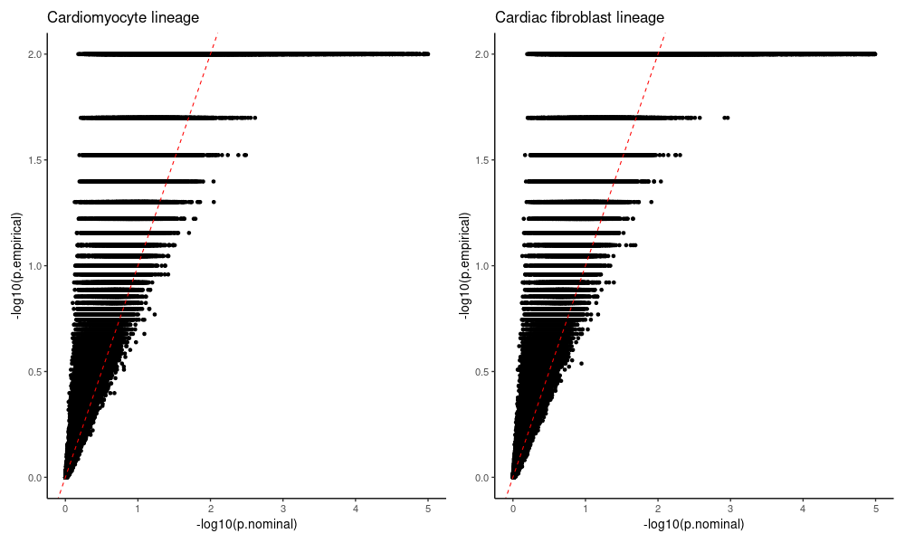

Compare the number of hits
```{r}
cm_hits_orig <- vroom("../results/eqtl_dynamic/linear_dQTL/pseudobulk-cm/bin16/50k-5clpcs-0pcs-notypes.tophits.tsv") %>%
  filter(qval.unadj<=0.05) %>%
  unite(gv, gene, snp, sep="--", remove=F)
cm_hits_permute <- vroom("../results/eqtl_dynamic/linear_dQTL/permuted_cells/pseudobulk-cm/bin16/50k-5clpcs-0pcs-notypes.tophits.tsv") %>%
  unite(gv, gene, snp, sep="--", remove=F)

tibble("original"=sum(cm_hits_permute$qval.unadj<=0.05))
```

