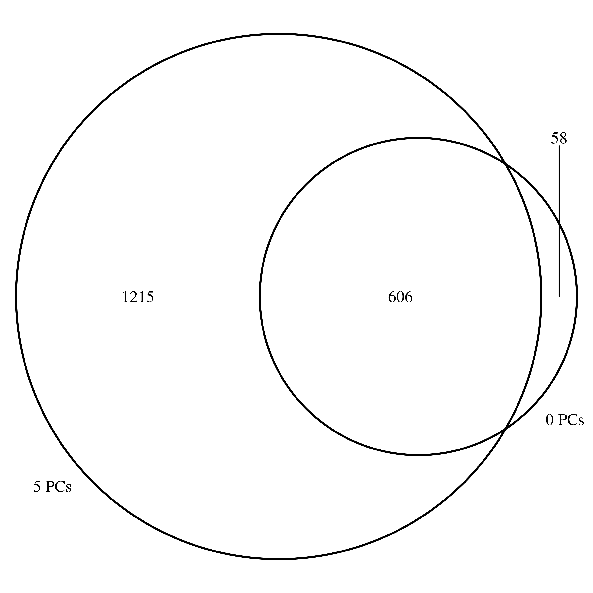
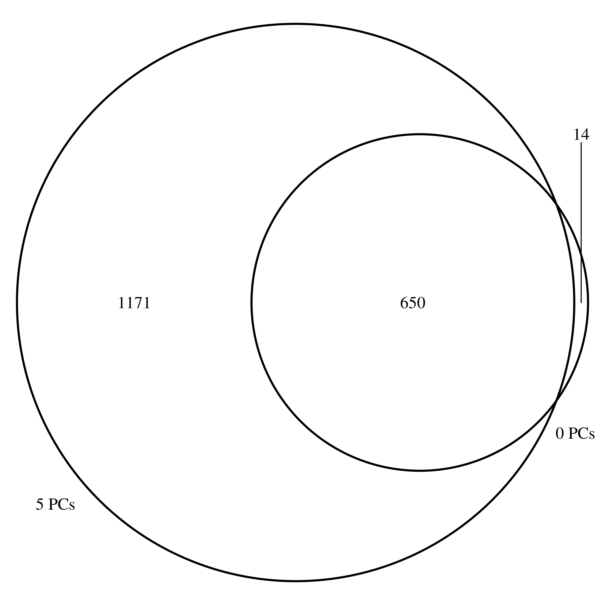

```{r}
library(tidyverse)
library(qvalue)
library(plotly)
library(patchwork)
library(ggpubr)
library(Seurat)
library(Nebulosa)
library(VennDiagram)
```
```{r}
sighits <- tibble("samp.pcs"=numeric(), "cl.pcs"=numeric(), "hits"=numeric())
for (n.samp.pc in c(0, 5, 10, 20)) {
  nhits <- read_tsv(paste0("../results/eqtl_dynamic/linear_dQTL/bulk/day/50k-5clpcs-", n.samp.pc, "pcs.tophits.tsv")) %>% 
      filter(qval.unadj<=0.05) %>% 
      nrow
  sighits <- bind_rows(sighits, tibble("samp.pcs"=n.samp.pc, "hits"=nhits))
}
sighits$samp.pcs <- factor(sighits$samp.pcs, levels=c(0, 5, 10, 20))
ggplot(sighits, aes(x=samp.pcs, y=hits, fill=samp.pcs)) + 
  geom_bar(position="dodge", stat="identity") +
  theme(axis.text.x=element_text(angle=45)) + 
  ylab("# significant egenes")
```

Are the 0 pc hits a subset of those we get after regressing out 5 pcs?
```{r}
pc0 <- read_tsv("../results/eqtl_dynamic/linear_dQTL/bulk/day/50k-5clpcs-0pcs.tophits.tsv") %>%
  filter(qval.unadj<=0.05) %>%
  mutate(gv=paste(gene, snp, sep="_"))
pc5 <- read_tsv("../results/eqtl_dynamic/linear_dQTL/bulk/day/50k-5clpcs-5pcs.tophits.tsv") %>%
  filter(qval.unadj<=0.05) %>%
  mutate(gv=paste(gene, snp, sep="_"))
pc10 <- read_tsv("../results/eqtl_dynamic/linear_dQTL/bulk/day/50k-5clpcs-10pcs.tophits.tsv") %>%
  filter(qval.unadj<=0.05) %>%
  mutate(gv=paste(gene, snp, sep="_"))
pc20 <- read_tsv("../results/eqtl_dynamic/linear_dQTL/bulk/day/50k-5clpcs-20pcs.tophits.tsv") %>%
  filter(qval.unadj<=0.05) %>%
  mutate(gv=paste(gene, snp, sep="_"))

pc0_hits <- pc0$gv
pc5_hits <- pc5$gv
pc10_hits <- pc10$gv

venn.diagram(x=list(pc0_hits, pc5_hits),
             category.names = c("0 PCs", "5 PCs"),
             filename="../figs/venn_0_5.png",
             imagetype="png")

```



Now just focus on gene intersection
```{r}
pc0_ghits <- pc0$gene
pc5_ghits <- pc5$gene
pc10_ghits <- pc10$gene

venn.diagram(x=list(pc0_hits, pc5_hits),
             category.names = c("0 PCs", "5 PCs"),
             filename="../figs/venn_0_5_gene.png",
             imagetype="png")
```


Do these hits appear in our pseudobulk data?
```{r}
n.qtls <- 5
surprise_egene <- setdiff(pc5_ghits, pc0_ghits)
surprises <- as_tibble(pc5_hits) %>%
  mutate(gene=str_extract(value, "[^_]+")) %>%
  mutate(gv=str_replace(value, "_chr", ".chr"), .keep="unused") %>%
  mutate(snp=str_extract(gv, "[^.]+$")) %>%
  mutate(gv=str_replace(gv, ".chr", "_chr")) %>%
  filter(gene %in% surprise_egene) %>%
  slice_sample(n=n.qtls)
bulk_expr_all <- read_tsv("../data/bulk/day/logtpm.tsv")
cm_expr_all <- read_tsv("../data/pseudobulk-cm/bin/logcpm.tsv")
cf_expr_all <- read_tsv("../data/pseudobulk-cf/bin/logcpm.tsv")
geno_all <- read_tsv("../data/genotypes.filtered.tsv")
```

```{r}
for (i in seq(1, nrow(surprises))) {
  egene <- surprises$gene[i]
  evar <- surprises$snp[i]
  bulk_expr <- bulk_expr_all %>% filter(gene==!!egene) %>% 
    column_to_rownames("gene") %>% t %>% 
    as_tibble(rownames="ind") %>% 
    `colnames<-`(c("sample", "logtpm")) %>%
    mutate(day=str_extract(sample, "[^_]+$")) %>%
    mutate(ind=str_extract(sample, "[^_]+")) %>%
    mutate(exp="bulk")
  cm_expr <- cm_expr_all %>% filter(gene==!!egene) %>% 
    column_to_rownames("gene") %>% t %>% 
    as_tibble(rownames="ind") %>% 
    `colnames<-`(c("sample", "logtpm")) %>%
    mutate(day=str_extract(sample, "[^_]+$")) %>%
    mutate(ind=str_extract(sample, "[^_]+")) %>%
    mutate(exp="cm")
  cf_expr <- cf_expr_all %>% filter(gene==!!egene) %>% 
    column_to_rownames("gene") %>% t %>% 
    as_tibble(rownames="ind") %>% 
    `colnames<-`(c("sample", "logtpm")) %>%
    mutate(day=str_extract(sample, "[^_]+$")) %>%
    mutate(ind=str_extract(sample, "[^_]+")) %>%
    mutate(exp="cf")
  expr <- bind_rows(bulk_expr, cm_expr, cf_expr)
  geno <- geno_all %>% filter(snp==evar) %>%
    column_to_rownames("snp") %>% t %>% 
    as_tibble(rownames="ind") %>% 
    `colnames<-`(c("ind", "genotype")) %>%
    mutate(ind=str_replace(ind, "NA", ""))
  dynvis <- left_join(expr, geno, by="ind") %>%
    mutate(logtpm=as.numeric(logtpm)) %>%
    mutate(genotype=factor(genotype, levels=c("0","1","2"))) %>%
    mutate(ind=factor(ind)) %>%
    mutate(day=factor(day, levels=seq(0, 15)))
  p1<-ggplot(filter(dynvis, exp=="bulk"), aes(x=day, y=logtpm, fill=genotype)) + 
    facet_grid(rows=vars(exp)) +
    geom_boxplot() +
    ylab(egene) +
    ggtitle(evar) +
    theme_classic()
  p2<-ggplot(filter(dynvis, exp=="cm"), aes(x=day, y=logtpm, fill=genotype)) + 
    facet_grid(rows=vars(exp)) +
    geom_boxplot() +
    ylab(egene) +
    ggtitle(evar) +
    theme_classic()
  p3 <- ggplot(filter(dynvis, exp=="cf"), aes(x=day, y=logtpm, fill=genotype)) + 
    facet_grid(rows=vars(exp)) +
    geom_boxplot() +
    ylab(egene) +
    ggtitle(evar) +
    theme_classic()
  print(p1 + p2 + p3 + plot_layout(ncol=1))
}
```

```{r}
sc_cardiac <- readRDS("../data/seurat.cardiac.rds")
plot_density(sc_cardiac, features=surprises$gene)
```

Classification 
```{r}
classify.dynqtl <- function(beta.g, beta.gxt, beta.t, ..., t.low=0, t.high=15, thresh=1) {
  beta.vgt.early = (beta.t*t.low + beta.gxt*0*t.low + beta.g*0) - (beta.t*t.low + beta.gxt*2*t.low + beta.g*2)
  beta.vgt.late = (beta.t*t.high + beta.gxt*0*t.high + beta.g*0) - (beta.t*t.high + beta.gxt*2*t.high + beta.g*2)
  
  if (sign(beta.vgt.early)==sign(beta.vgt.late)) {
    qtl.type = if_else(abs(beta.vgt.early)>=abs(beta.vgt.late), "early", "late")
  } else {
    if ((abs(beta.vgt.early)>=abs(beta.vgt.late)) & (abs(beta.vgt.late)<thresh)) {
      qtl.type = "early"
    } else if ((abs(beta.vgt.early)<abs(beta.vgt.late)) & (abs(beta.vgt.early)<thresh)) {
      qtl.type = "late"
    } else if ((abs(beta.vgt.early)>=thresh) & (abs(beta.vgt.late)>=thresh)) {
      qtl.type = "switch"
    }
  }
}
```

```{r}
count_pc0 <- pc0 %>%
  mutate(qtl.type=pmap_chr(., classify.dynqtl)) %>%
  group_by(qtl.type) %>%
  count %>%
  mutate(pcs="0")

count_pc5 <- pc5 %>% 
  mutate(qtl.type=pmap_chr(., classify.dynqtl))%>%
  group_by(qtl.type) %>%
  count %>%
  mutate(pcs="5")

count_pc10 <- pc10 %>% 
  mutate(qtl.type=pmap_chr(., classify.dynqtl))%>%
  group_by(qtl.type) %>%
  count %>%
  mutate(pcs="10")

count_pc20 <- pc20 %>% 
  mutate(qtl.type=pmap_chr(., classify.dynqtl))%>%
  group_by(qtl.type) %>%
  count %>%
  mutate(pcs="20")

bind_rows(count_pc0, count_pc5, count_pc10, count_pc20) %>%
  mutate(pcs=factor(pcs, levels=c(0, 5, 10, 20))) %>%
  ggplot(aes(x=pcs, y=n, fill=qtl.type)) +
  geom_bar(position="stack", stat="identity")
```

How about in pseudobulk? Does sample PC regression do the same thing there?
```{r}
cmpc0 <- read_tsv("../results/eqtl_dynamic/linear_dQTL/pseudobulk/cmbin/50k-5clpcs-0pcs.tophits.tsv") %>%
  filter(qval.unadj<=0.05) %>%
  mutate(gv=paste(gene, snp, sep="_"))
cmpc5 <- read_tsv("../results/eqtl_dynamic/linear_dQTL/pseudobulk/cmbin/50k-5clpcs-5pcs.tophits.tsv") %>%
  filter(qval.unadj<=0.05) %>%
  mutate(gv=paste(gene, snp, sep="_"))
cmpc10 <- read_tsv("../results/eqtl_dynamic/linear_dQTL/pseudobulk/cmbin/50k-5clpcs-10pcs.tophits.tsv") %>%
  filter(qval.unadj<=0.05) %>%
  mutate(gv=paste(gene, snp, sep="_"))
cmpc20 <- read_tsv("../results/eqtl_dynamic/linear_dQTL/pseudobulk/cmbin/50k-5clpcs-20pcs.tophits.tsv") %>%
  filter(qval.unadj<=0.05) %>%
  mutate(gv=paste(gene, snp, sep="_"))

```

```{r}
count_cmpc0 <- cmpc0 %>%
  mutate(qtl.type=pmap_chr(., classify.dynqtl)) %>%
  group_by(qtl.type) %>%
  count %>%
  mutate(pcs="0")

count_cmpc5 <- cmpc5 %>% 
  mutate(qtl.type=pmap_chr(., classify.dynqtl))%>%
  group_by(qtl.type) %>%
  count %>%
  mutate(pcs="5")

count_cmpc10 <- cmpc10 %>% 
  mutate(qtl.type=pmap_chr(., classify.dynqtl))%>%
  group_by(qtl.type) %>%
  count %>%
  mutate(pcs="10")

count_cmpc20 <- cmpc20 %>% 
  mutate(qtl.type=pmap_chr(., classify.dynqtl))%>%
  group_by(qtl.type) %>%
  count %>%
  mutate(pcs="20")

bind_rows(count_cmpc0, count_cmpc5, count_cmpc10, count_cmpc20) %>%
  mutate(pcs=factor(pcs, levels=c(0, 5, 10, 20))) %>%
  mutate(qtl.type=factor(qtl.type, levels=c("early", "switch", "late"))) %>%
  ggplot(aes(x=pcs, y=n, fill=qtl.type)) +
  geom_bar(position="stack", stat="identity")
```

