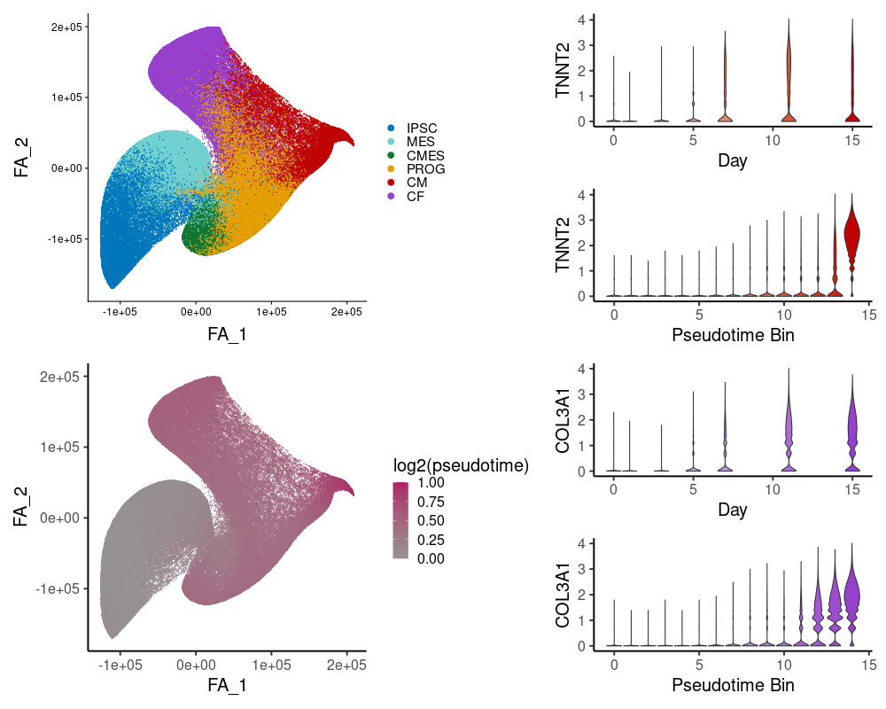

```{r}
suppressPackageStartupMessages(library(tidyverse))
suppressPackageStartupMessages(library(Seurat))
suppressPackageStartupMessages(library(scales))
suppressPackageStartupMessages(library(cowplot))
suppressPackageStartupMessages(library(patchwork))
```

```{r}
sc_cardiac <- readRDS("data/seurat.annotated.rds")
sc_cm <- readRDS("data/seurat.cm.rds")
sc_cf <- readRDS("data/seurat.cf.rds")
```

```{r}
my_cols <- c("#0077BB", "#70d1d0", "#117733", "#E69F00", "#BF0202", "#9640CE")
```

Visualize the distribution of pseudotime across our data
```{r include=FALSE}
fig2a <- DimPlot(sc_cardiac, group.by="type", reduction="fa", cols=my_cols) + 
  theme(title=element_text(size=0), axis.title=element_text(size=20), 
        legend.text=element_text(size=15), legend.title=element_text(size=20))

fa <- as_tibble(sc_cardiac@reductions$fa@cell.embeddings) %>%
  mutate(pseudotime=sc_cardiac$pseudotime) %>%
  mutate(log_pseudotime=log2(pseudotime+1))

fig2b <- ggplot(fa, aes(x=`FA_1`, y=`FA_2`, color=`log_pseudotime`)) +
  geom_point(size=0.01, alpha=0.5) +
  theme_classic(base_size=20) +
  labs(color="log2(pseudotime)") +
  scale_color_gradient(low="#949494", high="#AA2168")
```

Look at the distribution of pseudotime within each day, cell type, and pseudotime bin
```{r}
pseudo.cm <- as_tibble(sc_cm@meta.data[,c("diffday", "type", "pseudotime")], rownames="cell") %>%
  rowid_to_column("orig_order") %>%
  arrange(pseudotime) %>%
  rowid_to_column("time_order") %>% 
  mutate(bin=floor(15*time_order/nrow(.)), .keep="unused") %>%
  mutate(bin=sapply(bin, function(x){min(x, 14)})) %>%
  mutate(day=as.numeric(str_replace(diffday, "day", ""))) %>%
  arrange(orig_order)
pseudo.cm$TNNT2 <- sc_cm[["SCT"]]@data["TNNT2",]
```

```{r include=FALSE}
fig2c <- ggplot(pseudo.cm, aes(x=day, y=TNNT2, fill=day, group=diffday)) +
  geom_violin(trim=T, scale="width")+
  theme_classic(base_size=20) +
  theme(legend.position="none") +
  xlab("Day") +
  ylab("TNNT2") +
  scale_fill_gradient(low="#DEDEDE", high=my_cols[5])

fig2d <- ggplot(pseudo.cm, aes(x=bin, y=TNNT2, fill=bin, group=bin)) +
  geom_violin(trim=T, scale="width")+
  theme_classic(base_size=20) +
  theme(legend.position="none") +
  xlab("Pseudotime Bin") +
  ylab("TNNT2") +
  scale_fill_gradient(low="#DEDEDE", high=my_cols[5])
```

Now we perform a similar analysis for our other lineage
```{r}
pseudo.cf <- as_tibble(sc_cf@meta.data[,c("diffday", "type", "pseudotime")], rownames="cell") %>%
  rowid_to_column("orig_order") %>%
  arrange(pseudotime) %>%
  rowid_to_column("time_order") %>% 
  mutate(bin=floor(15*time_order/nrow(.)), .keep="unused") %>%
  mutate(bin=sapply(bin, function(x){min(x, 14)})) %>%
  mutate(day=as.numeric(str_replace(diffday, "day", ""))) %>%
  arrange(orig_order)
pseudo.cf$COL3A1 <- sc_cf[["SCT"]]@data["COL3A1",]
```


```{r include=FALSE}
fig2e <- ggplot(pseudo.cf, aes(x=day, y=COL3A1, fill=day, group=diffday)) +
  geom_violin(trim=T, scale="width")+
  theme_classic(base_size=20) +
  theme(legend.position="none") +
  xlab("Day") +
  ylab("COL3A1") +
  scale_fill_gradient(low="#DEDEDE", high=my_cols[6])

fig2f <- ggplot(pseudo.cf, aes(x=bin, y=COL3A1, fill=bin, group=bin)) +
  geom_violin(trim=T, scale="width")+
  theme_classic(base_size=20) +
  theme(legend.position="none") +
  xlab("Pseudotime Bin") +
  ylab("COL3A1") +
  scale_fill_gradient(low="#DEDEDE", high=my_cols[6])
```

```{r}
grid.layout="
AACC
AADD
BBEE
BBFF
"
fig2 <- fig2a + fig2b + fig2c + fig2d + fig2e + fig2f +
  plot_layout(design=grid.layout)

png('figs/fig2/fig2.png', width=1000, height=800)
plot(fig2)
dev.off()
```
