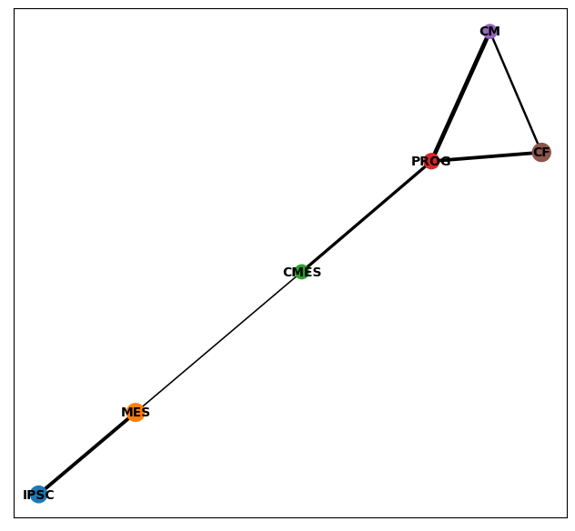
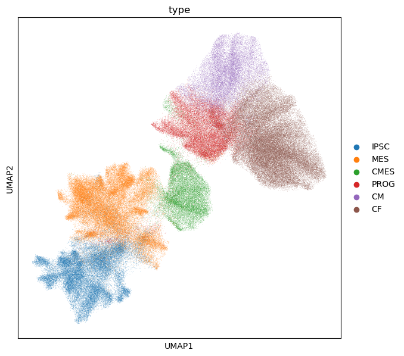
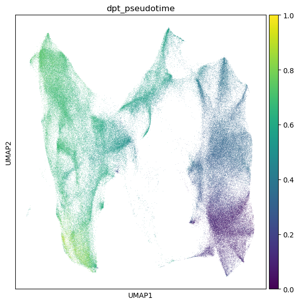
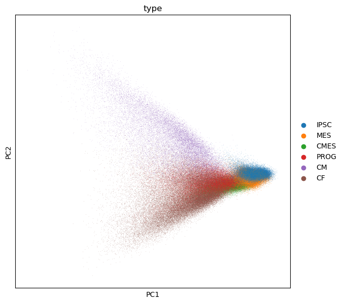

```{r}
library(tidyverse)
library(reticulate)
use_condaenv('singlecell')
scp <- import("scanpy")
scp$settings$figdir = "../figs/"
library(Seurat)
```

```{r}
sc <- readRDS("../data/seurat.normalized.rds")
hvf.genes <- rownames(sc@assays$SCT@scale.data)
```

```{r}
adata <- scp$read_h5ad("../data/seurat.annotated.sct.h5ad")
```

```{r}
scp$pp$highly_variable_genes(adata, n_top_genes=3000)
scp$pp$scale(adata)
scp$tl$pca(adata)
```

```{r}
scp$pl$pca(adata, color="leiden")
```

```{r}
scp$pl$draw_graph(adata, color=c('leiden', 'dpt_pseudotime', 'TNNT2'))
```

```{r}
scp$pp$neighbors(adata, n_neighbors=20, n_pcs=50)
```

```{r}
scp$pl$umap(adata, color=c('leiden', 'dpt_pseudotime'))
```

```{r}
scp$tl$diffmap(adata)
```

```{r}
scp$pl$pca(adata, color='type', components=c(1L,3L))
```

```{r}
scp$pl$diffmap(adata, color=c('type', 'leiden_06', 'percent.mito'))
```

```{r}
scp$pl$scatter(adata, x="APOA1", y="nCount_RNA")
```

```{r}
scp$pl$pca_loadings(adata, components=c(4L,5L,6L))
```

```{r}
scp$tl$paga(adata, groups='leiden')
```

```{r}
adata <- scp$read_h5ad("../data/scanpy.clustered.h5ad")
```

```{r}
scp$tl$paga(adata, groups='leiden_05')
```
```{r}
scp$pl$paga(adata, threshold=0.1)
```

```{r}
scp$pl$umap(adata, color=c('leiden_05', 'diffday'))
```

```{r}
scp$tl$leiden(adata, resolution=0.5)

```

```{r}
scp$pl$draw_graph(adata, color='leiden')
```


```{r}
scp$tl$umap(adata, init_pos='paga')
scp$pl$umap(adata, color='type', save="_paga.png")
```


Set an iPSC cell to root - min UMAP2 coordinate appears to correspond w early pseudotime
```{r}
umap <- as_tibble(adata$obsm['X_umap']) %>% 
  `colnames<-`(c("UMAP1", "UMAP2")) %>%
  rowid_to_column()
root <- as_tibble(adata$obs['type'], rownames="cell") %>%
  `colnames<-`(c("cell", "type")) %>%
  mutate(type=sapply(type, as.character)) %>%
  rowid_to_column() %>%
  right_join(umap, by="rowid") %>%
  arrange(UMAP2) %>%
  slice_head(n=1) %>%
  .$rowid
adata$uns$update('iroot'=as.integer(root-1))
sc$tl$dpt(adata)
sc$pl$umap(adata, color='dpt_pseudotime', save="_pseudo2.png")
```

```{r}
pseudotime_hacky <- adata$obs['dpt_pseudotime'] %>% as_tibble(rownames="cell") %>%
  write_tsv("data/pseudotimes.hacky.tsv")
```

```{r}
sc$pl$pca(adata, color='type', save=".png")
```
